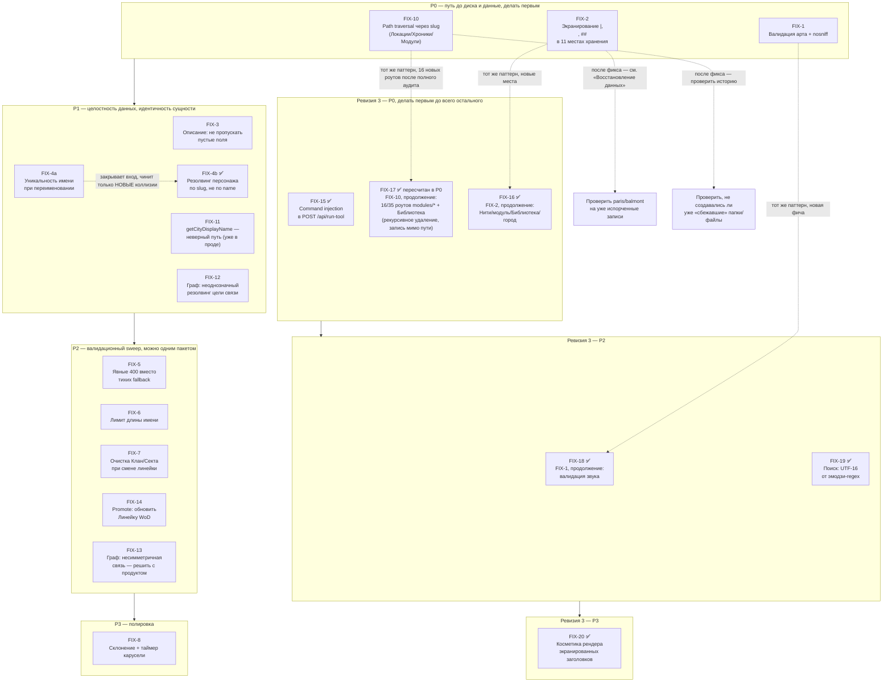

# План исправлений — свод по семи QA-отчётам от 2026-07-28/29

**Автор:** роль «Системный аналитик»
**Входные данные:**
- [`2026-07-28-character-creation-qa-report.md`](2026-07-28-character-creation-qa-report.md) — создание персонажа
- [`2026-07-28-characters-chronology-qa-report.md`](2026-07-28-characters-chronology-qa-report.md) — раздел «Персонажи» (без создания) + «Хронология»
- [`2026-07-28-char-modal-transition-qa-report.md`](2026-07-28-char-modal-transition-qa-report.md) — переход в модальное окно персонажа и само окно
- [`2026-07-28-links-factions-locations-qa-report.md`](2026-07-28-links-factions-locations-qa-report.md) — «Связи», «Фракции», «Локации»
- [`2026-07-29-session-chronicles-qa-report.md`](2026-07-29-session-chronicles-qa-report.md) — «Сессия» (журнал/заметки), «Хроники» (создание/перенос)
- [`2026-07-29-modules-qa-report.md`](2026-07-29-modules-qa-report.md) — модули, продвижение НПС в канон
- [`2026-07-30-session-modules-threads-rumors-audio-qa-report.md`](2026-07-30-session-modules-threads-rumors-audio-qa-report.md) — Сессия (заметки+журнал), создание модуля, Нити, Слухи, Звуки
- [`2026-07-30-library-tools-cities-search-qa-report.md`](2026-07-30-library-tools-cities-search-qa-report.md) — Библиотека, Инструменты (создание НПС/дисциплин/запуск утилит), Города (создание), Поиск

**Ревизия 2 (2026-07-29):** добавлены FIX-10…FIX-14 по трём новым
отчётам. Изменение по сравнению с ревизией 1: **приоритеты
пересчитаны** — path traversal (FIX-10) оказался серьёзнее всего, что
было найдено раньше, включая XSS (FIX-1), и встаёт первым пунктом
цикла. FIX-2 расширен с 3 до 11 подтверждённых мест одного и того же
паттерна — это не разовая находка, а системная брешь в том, как проект
пишет свободный пользовательский текст в markdown-хранилище.

**Ревизия 3 (2026-07-30):** добавлены FIX-15…FIX-20 по двум новым
отчётам (следующий заход тестирования, после того как FIX-1…FIX-14 уже
были в проде). Главное изменение: найдена **command injection** (FIX-15) —
серьёзнее всего, что находилось за оба цикла, включая path traversal;
встаёт первым пунктом, без обсуждения. Второе — паттерны FIX-2
(свободный текст ломает структуру) и FIX-10 (клиентский путь-сегмент без
санитизации) оказались **не закрыты полностью** в первом цикле — те же
два класса бага нашлись в областях, которые тогда не тестировались
(Нити, создание модуля/города/дисциплины, Библиотека, журнал сессий).
Не переоткрываю FIX-2/FIX-10 задним числом (они честно закрывали то, что
было найдено на тот момент) — новые места идут отдельными пунктами
FIX-16/FIX-17 с явной пометкой «тот же паттерн».

**Метод:** 21 отдельная находка семи отчётов сгруппирована в 14 рабочих
пунктов (FIX-1…FIX-14) по общей первопричине. Два паттерна поглощают
большинство точечных находок: FIX-2 (свободный текст ломает структуру
хранения — 11 мест) и FIX-10 (клиентский `slug` не санитизируется перед
`path.join` — 3 места, один из них с удвоенным эскейпом). Это не «21
патч», а по сути 14 задач, три из которых — общий фикс на несколько мест.

**Ревизия 3 — метод:** 10 находок двух новых отчётов сгруппированы в 6
пунктов (FIX-15…FIX-20). FIX-16 продолжает FIX-2 (4 новых места: Нити,
концепция модуля, создание дисциплины/способности в Библиотеке, «Карта
фракций» при создании города). FIX-17 продолжает FIX-10 — изначально
заявлен по 2 находкам (журнал сессий, PUT/DELETE дисциплин/способностей),
но по рекомендации того же отчёта дополнен **полным аудитом всех 35
роутов `web/routes/modules/*.js`** (2026-07-30): реальный масштаб — 16
незащищённых роутов, приоритет пересчитан с P1 на **P0** (среди них —
рекурсивное удаление произвольной директории и запись с атакующим
контролем пути назначения). FIX-15 (command injection), FIX-18
(валидация звука), FIX-19 (UTF-16 в поиске), FIX-20 (косметика рендера
экранированных заголовков) — изолированные, новых первопричин, не
встречавшихся раньше.

---

## Сводная таблица

| ID | Приоритет | Класс | Объём | Источник | Статус |
|----|-----------|-------|-------|---------------------|--------|
| **FIX-10** | **P0 (security, самое срочное)** | **Системный паттерн** (3 места, 1 с удвоением) | M | session-chronicles-report #1, #2; links-factions-locations-report #1 | ✅ |
| FIX-1 | P0 (security) | Изолированный | S | creation-report #1 | ✅ |
| FIX-2 | P0 (data integrity) | **Системный паттерн** (11 мест) | L | chronology-report #1,#2; links-factions-locations-report #2; session-chronicles-report #3,#4; modules-report (табл. «ещё подтверждения») | ✅ |
| FIX-3 | P1 | Изолированный | S | modal-report #1 | ✅ |
| FIX-4a | P1 (митигация) | Изолированный | S | modal-report #2 | ✅ |
| FIX-4b | Backlog (структурный) | Архитектурный | L | modal-report #2 | ✅ реализовано (2026-07-30), полный охват модалки персонажа |
| FIX-11 | P1 (уже в проде) | Изолированный, тривиальный | XS | modules-report #1 | ✅ |
| FIX-12 | P1 | Изолированный | S | links-factions-locations-report #3 | ✅ |
| FIX-5 | P2 | Системный паттерн (3 места) | S | creation-report #2, #5; chronology-report #3 | ✅ |
| FIX-6 | P2 | Изолированный | S | creation-report #4 | ✅ |
| FIX-7 | P2 | Изолированный | XS | creation-report #3 | ✅ |
| FIX-14 | P2 | Изолированный | S | modules-report #2 | ✅ |
| FIX-13 | P2 / продукт | Изолированный, требует решения | S | links-factions-locations-report #4 | ✅ решение продукта (2026-07-30): одно ребро, подпись с обеих сторон (hover-тултип на ребре + инфопанель персонажа) |
| FIX-8 | P3 | Полировка | XS×2 | chronology-report #4; modal-report #3 | ✅ |
| FIX-9 | Backlog | Продуктовое решение, не баг | — | creation-report #6 | ✅ решение продукта (2026-07-30): добавлены поля Оборотня (Племя/Каста) и Мага (Традиция); Охотник — вне объёма (не имеет отдельной системы в проекте, маппится на Смертного) |

**Аудит существующих данных (`cities/paris`/`cities/balmont`) на порчу от FIX-2/FIX-10 проведён 2026-07-30** —
подтверждённой порчи не найдено; попутно исправлены два несвязанных мелких
дефекта данных (расхождение заголовка/данных в одном V20-листе, лишние `|`
в одной ручной строке `timeline.md`).

**Реалистичный план на один цикл:**
**FIX-10 → FIX-1 → FIX-2 → FIX-3 → FIX-11 → FIX-4 (митигация) → FIX-12 →
FIX-5/6/7/14 одним пакетом → FIX-13 (решить с продуктом) → FIX-8.**
FIX-4 (структурная часть) и FIX-9 — вне цикла, отдельные задачи.

---

### Ревизия 3 (2026-07-30) — сводная таблица

| ID | Приоритет | Класс | Объём | Источник | Статус |
|----|-----------|-------|-------|---------------------|--------|
| **FIX-15** | **P0 (RCE, самое срочное)** | Изолированный | S | library-tools-cities-search-report #1 | ✅ |
| FIX-16 | P0 (data integrity, продолжает FIX-2) | **Системный паттерн** (4 новых места) | M | session-modules-threads-report #1, #3; library-tools-cities-search-report #3, #4 | ✅ |
| FIX-17 | **P0** (пересчитан после полного аудита — продолжает FIX-10) | **Системный паттерн** (16 из 35 роутов `modules/*.js` + 2 в `library.js`) | M | session-modules-threads-report #2; library-tools-cities-search-report #2; полный аудит 2026-07-30 | ✅ |
| FIX-18 | P2 (продолжает FIX-1) | Изолированный | S | session-modules-threads-report #5 | ✅ |
| FIX-19 | P2 | Изолированный | XS | library-tools-cities-search-report #5 | ✅ |
| FIX-20 | P3 | Изолированный, архитектурно неоднозначный | S | session-modules-threads-report #4 | ✅ |

**Реалистичный план на цикл 3 (пересчитан):** **FIX-15 (немедленно, до
всего остального) → FIX-17 (пересчитан в P0 после полного аудита —
`lifecycle.js` рекурсивное удаление и `npc.js` запись с контролируемым
путём назначения серьёзнее большинства находок цикла 1) → FIX-16 →
FIX-18 → FIX-19 → FIX-20.**

---

## Диаграмма зависимостей



---

## FIX-10 [P0 · Security, самое срочное] Path traversal через клиентский `slug` — три места, одно с удвоенным эскейпом

**Находки:** session-chronicles-report #1 (создание хроники), #2
(создание модуля, удвоение), links-factions-locations-report #1
(создание локации — первое обнаруженное место паттерна, вчера).

**Первопричина (общая для всех трёх):** три независимых
POST-эндпоинта создания ресурса принимают путь-сегмент от клиента без
прогона через `slugify()`:

| Место | Файл:строка | Поле | Куда используется |
|---|---|---|---|
| Локация | `web/routes/locations.js:280` | `district` (`.trim()` — и всё) | `path.join(locsDir(city), distFolder, locSlug)` |
| Хроника | `web/routes/chronicles.js:173` | `slug` (`req.body.slug?.trim() \|\| slugify(display)`) | `path.join(chroniclesDir(city), slug)` |
| Модуль | `web/routes/modules/list.js:102` | `slug` (та же конструкция) | **дважды**: `modDir` (строка 105) и `` path.join(modDir, `${modSlug}.md`) `` (строка 163) |

**Подтверждено живьём (см. отчёты, воспроизведено на диске в
одноразовых тестовых городах):**
- Локация с `district: "../../qa_traversal_probe"` → файл создан в
  `cities/qa_traversal_probe/...` — на 2 уровня выше домена города.
- Хроника с `slug: "../../qa_chronicle_traversal"` → файлы `chronicle.md`/
  `events.md`/`open_threads.md` в `cities/qa_chronicle_traversal/` —
  рядом с `cities/`, а не внутри города.
- Модуль с `slug: "../../../qa_module_traversal"` → директория эскейпнула
  на 3 уровня, а файл содержимого — **ещё раз через тот же непроверенный
  slug**, использованный повторно в `path.join(modDir, ...)`, — итоговый
  файл оказался **в корне репозитория**, на 5 уровней выше исходной
  точки, а не 3. Глубина эскейпа складывается там, где значение
  переиспользуется без единой точки санитизации.

**Кто может это ввести:** для хроники — реально, через видимое
редактируемое поле «slug» в модалке «+ Новая хроника»
(`web/public/scripts/modules.js:763-800`, `#chr-create-slug`
рассинхронизируется с названием после первой ручной правки). Для
локации/модуля не проверял, есть ли аналогичное видимое поле в
соответствующих формах — но раз контракт API идентичен, риск тот же
при любом способе достижения этого тела запроса.

**Предлагаемое решение:** единый хелпер (например,
`safePathSegment(input)` рядом с уже существующим `slugify()` в
`web/lib/parsers/shared.js`) — прогонять **любое** значение, которое
попадёт в `path.join(...Dir(city), ...)`, через него **сразу при
получении**, а не точечно в каждом роуте. Явно:
1. `web/routes/locations.js:280` — `distFolder = slugify(district) || 'Другие'` (или отдельный вайтлист, если хочется сохранять читаемое название округа не транслитом).
2. `web/routes/chronicles.js:173` — `slug = slugify(req.body.slug || display)`.
3. `web/routes/modules/list.js:102` — `modSlug = slugify(req.body.slug || name)`, и **не пересобирать** `modSlug` заново для имени файла — использовать уже вычисленную безопасную переменную один раз.

**Восстановление уже возможного ущерба:** до/вместе с деплоем — разовая
проверка `cities/` на посторонние директории/файлы рядом с известными
городами (маловероятно, что уже произошло в проде, но дёшево
исключить).

**Оценка:** M — три точки правки, но с общим хелпером, плюс разовая
проверка истории.

---

## FIX-1 [P0 · Security] Валидация загружаемого арта + `nosniff`

**Находка:** creation-report #1 (Stored XSS через `upload-image`).

**Затронутые компоненты:**
- `web/routes/characters.js:540` — `POST /api/characters/:slug/upload-image`
- `web/server.js:85` — `express.static(CITIES_DIR, ...)` на `/city-img`

**Контракт сейчас:** эндпоинт принимает `{ base64, ext }`, `ext` фильтруется
только `[^a-z]` (пропускает `html`, `svg`, `js` — любые буквенные
расширения), содержимое `base64` не проверяется вообще. Раздача —
`express.static` без `X-Content-Type-Options`.

**Предлагаемый контракт:**
1. Белый список `ext` на входе: `jpg|jpeg|png|webp|gif`, иначе `400`.
2. Проверка magic bytes декодированного буфера (первые 4-12 байт)
   соответствуют заявленному типу — отклонять несовпадение `400`, а не
   доверять клиентскому `ext`.
3. `X-Content-Type-Options: nosniff` на статику `/city-img` (middleware
   уровня роута, не глобально — чтобы не задеть остальные статик-раздачи
   без необходимости).

**Оценка:** S — один эндпоинт + один заголовок.

---

## FIX-2 [P0 · Data integrity] Свободный текст рвёт структуру хранения — 11 подтверждённых мест

**Находки:** chronology-report #1 (`\n` в «Отношениях» — необратимая
порча), #2 (`\|` в Хронологии мира/Состоянии мира);
links-factions-locations-report #2 (`\|` в названии фракции при
создании, `\|` в инлайн-метаданных локации — другой формат хранения,
не таблица); session-chronicles-report #3 (`##` в заметке журнала
сессий — **фабрикует целую поддельную запись**, не просто искажает
поле), #4 (`###` в заметке по сцене — та же уязвимость в другом
парсере); modules-report (таблица «ещё подтверждения»: `\|` в поле
«Тон» модуля, `\n` в списке ПК, `\n`+`##` в имени НПС модуля).

**Первопричина (общая для всех одиннадцати):** значение, введённое
пользователем, пишется в структурированный plain-text формат
(маркированный список / pipe-таблица / markdown-заголовок как
разделитель записей) без экранирования управляющего символа/паттерна
этого формата. `PUT /api/characters/:slug/fields` эту защиту имеет для
своих полей (`.replace(/\n+/g, ' ')`) — остальные десять мест её не
унаследовали, потому что писались независимо друг от друга.

**Затронутые компоненты (полный список):**

| # | Место | Символ/паттерн | Файл | Эффект |
|---|---|---|---|---|
| 1 | Отношения персонажа | `\n` | `web/routes/characters.js:280` (`PUT /:slug/relations`) | осиротевшая строка, не убирается даже полной очисткой |
| 2 | Хронология мира (строка эпохи) | `\|` | `web/lib/parsers/timeline.js` (`_serializeTable`) | ячейка расползается на лишнюю колонку |
| 3 | Состояние мира (строка секции) | `\|` | `web/lib/parsers/worldState.js` (своя копия `_serializeTable`) | то же |
| 4 | Название фракции (новая строка) | `\|` | `web/lib/parsers/city.js:282` (`setPoliticalFactionInfluence`) | имя обрезается, влияние теряется, часть текста утекает в «Территория» |
| 5 | Инлайн-метаданные локации (Округ/Район/Адрес/Зона/Контроль) | `\|` | `web/routes/locations.js:207-215` | текст повисает между двумя полями заголовка карточки |
| 6 | Журнал сессий, поле «Что произошло» | `## Сессия N` | `web/routes/modules/shared.js:371-391` (`_parseSessions`) | **фабрикует целую поддельную запись сессии** с произвольными «Сыграно сцен»/«Статус модуля» |
| 7 | Заметка по сцене | `### Сессия N` | `web/lib/parsers/scenario.js:37+` (`parseScenarioSections`) | фабрикует поддельную подзапись в истории заметок сцены |
| 8 | Поле «Тон»/«Тип»/«Время»/«Локация»/«Формат» модуля | `\|` | `web/routes/modules/fields.js:46-62` | лишняя колонка в таблице параметров модуля |
| 9 | Список «Персонажи игроков» модуля | `\n` | `web/routes/modules/fields.js:88-96` | осиротевшая строка, как №1 |
| 10 | Имя НПС модуля | `\n` + `##` | `web/routes/modules/npc.js:117-137` | похожий на заголовок текст в `npc.md` |
| 11 | (для справки) `PUT /fields` персонажа — **уже защищено**, эталон | `\n` → пробел | `web/routes/characters.js:254` | — |

**Предлагаемое решение:**
1. **Разделители внутри списков/полей (`\n`)** — места №1, 9: нормализовать
   `\n` → пробел на входе, как уже сделано в №11 (эталон).
2. **Разделители внутри pipe-таблиц (`\|`)** — места №2, 3, 4, 5, 8:
   экранировать `|` → `\|` при сериализации ячейки, разэкранировать при
   парсинге. Четыре из пяти — независимые копипасты одной и той же пары
   `_serializeTable`/`_parsePipeTable` (`timeline.js`, `worldState.js`,
   `city.js`, плюс своя логика в `locations.js`/`fields.js` для
   инлайн-формата) — стоит вынести в общий модуль
   (`web/lib/parsers/shared.js`) один раз, а не патчить четыре копии
   отдельно.
3. **Границы записей через заголовки (`##`/`###`)** — места №6, 7,
   10: не давать строкам тела начинаться с `#`-последовательности,
   которую парсер распознаёт как заголовок (например, экранировать
   ведущий `#` как `\#` в свободном тексте перед записью, либо — более
   общее решение — перейти на хранение количества/границ записей явно в
   структуре, которую текст не может подделать).
4. **Восстановление уже испорченных данных.** Находки №1 и №6/№7
   зафиксированы как **не лечащиеся через UI** — испорченное состояние
   переживает дальнейшие правки. Рекомендация: до/вместе с деплоем —
   разовый скрипт-сканер по `cities/*/characters/**/*.md`,
   `cities/*/archive/{timeline,events}.md`,
   `cities/*/chronicles/*/modules/*/{sessions,scene_notes}.md`, который
   находит структурные аномалии (неотступленные строки внутри
   «Отношения:»/списков, строки pipe-таблицы с числом ячеек ≠ числу
   колонок заголовка, подозрительно короткие/пустые «сессии» с
   round-number «Сыграно сцен») и либо чинит автоматически, либо
   выводит список для ручной проверки. Формат — как `tools/migrations/`.

**Оценка:** L — десять точек правки (из них минимум 4-5 сводятся к
одному общему модулю), плюс расширенный скрипт-сканер для
восстановления по трём разным типам файлов.

---

## FIX-3 [P1] Панель «Описание»: не пропускать пустые значения при сохранении

**Находка:** modal-report #1.

**Компонент:** `web/public/scripts/char-detail.js:528-556`
(`_savePanelEdit`, ветка `panel === 'desc'`).

**Контракт сейчас:** `if (voice) fields.voice = voice;` — очищенное поле
(пустая строка) не попадает в `PUT /fields`, сервер трактует «поле
отсутствует в теле» как «поле не трогать» → значение на диске не меняется,
хотя локальный `STATE` и вид панели уже показывают пусто (ложный
«✓ Сохранено»).

**Предлагаемое решение:** слать все 5 полей панели («Описание») в `fields`
безусловно — как уже сделано для `bio` в той же функции (`fields.biography
= bio` без условия). Однострочный по духу фикс, но затрагивает 5 веток
внутри одной функции.

**Оценка:** S.

---

## FIX-4 [P1 митигация / backlog структурная часть] Идентичность персонажа: имя vs slug

**Находка:** modal-report #2.

**Первопричина:** в системе две модели идентичности персонажа. `slug` —
контрактный уникальный идентификатор (проверяется на дубликат при
создании, `409` — `web/routes/characters.js:336-337`). Но **при
переименовании** (`PUT /fields`, ключ `name`) уникальность **не
проверяется вовсе** — и в нескольких местах клиента резолвинг персонажа
идёт по имени, не по slug:
- `openCharDetail(name)` — `web/public/scripts/char-detail.js:31`
- `_charSlug(name)` — `web/public/scripts/scripts.js:1575`
- карточки в гриде несут `data-name`, не `data-slug`

При коллизии имён это не косметика — «второй» персонаж становится
недостижим через интерфейс полностью (доказано кликом по конкретной
DOM-карточке в отчёте).

**FIX-4a — митигация (делать сейчас, P1):** добавить проверку
уникальности нового имени в `PUT /fields` при `key === 'name'` — по духу
та же проверка, что уже есть в `POST /api/characters` на slug, только
здесь предмет сравнения — итоговое отображаемое имя среди персонажей
города. `409`, если совпадает с уже существующим (кроме самого себя).
Закрывает **вход** в баг — новые коллизии станут невозможны.

**FIX-4b — структурная часть — ✅ реализовано (2026-07-30), отдельным циклом
от P0/P1-пакета, после явного решения продукта.** Объём оказался шире
одной строки «резолвить по slug» — весь опыт карточка-персонажа→модалка
(список, открытие, редактирование полей/отношений/описания, генерация
внешности/характера/биографии/промта/реплик, дневники, вкладка «Лист
V20», удаление, загрузка изображений) резолвится по `slug`, не по
`name`, во ВСЕХ точках входа: клик по карточке в гриде (`data-slug`),
переход из поиска, клик по персонажу в журнале сессии, по ссылке
`[Карточка]` из модуля, по чипу участника в хронологии. Граф связей
(`web/public/scripts/graph.js`) сознательно НЕ трогали — отдельная
система, id узлов там всё ещё имя с сервера (см. FIX-13). Затронуты:
`web/public/scripts/char-detail.js`
(почти целиком), `scripts.js` (грид/карусель/дневники/foundry-bulk),
`v20-sheet.js` (`_v20Ctx` теперь несёт `slug`), `archive.js`,
`modules.js`, `session-screen.js`, `search.js`, `web/routes/characters.js`
(`GET /api/characters/all-images` теперь ключует по `char.slug`).
Осознанно НЕ тронуто (собственный текстовый формат хранения, не
идентичность): даталист автокомплита в редакторе «Отношения», пикеры
НПС/ПК в модуле, предвыбор в журнале сессии, дровер выбора персонажа в
кубик-роллере — там имя пишется как текст в `.md`-файлы, перевод на slug
означал бы менять формат хранения этих файлов, а не только код (см.
обсуждение с пользователем).

Побочный эффект работы: найден и исправлен независимый баг в
`POST /:slug/upload-image` — при повторной загрузке арта в карточку, где
секция «## 🖼️ Изображения» последняя (без следующего `##`), regex
накапливал по одной лишней пустой строке в конце файла на каждую
загрузку (не влияло на данные, только на whitespace).

**Пользователям, обновляющимся с версии до этого фикса:** прогнать
`node tools/check_duplicate_names.js` — найдёт персонажей, у которых уже
существует коллизия отображаемого имени (могла возникнуть до FIX-4a,
когда переименование не проверяло уникальность). Ничего не меняет на
диске — только показывает; после FIX-4b такая коллизия больше не ломает
интерфейс (оба персонажа корректно открываются и редактируются по
отдельности), переименовывать не обязательно, только для собственного
удобства.

**Оценка:** FIX-4a — S (сделано). FIX-4b — L, сделано полным охватом
модалки после уточнения продукта, не одной строкой.

---

## FIX-11 [P1, уже в продакшене] `getCityDisplayName()` — неверный путь, никогда не находит `city.md`

**Находка:** modules-report #1.

**Компонент:** `web/routes/modules/shared.js:60-67`.

```js
const cityMdPath = path.join(__dirname, '..', 'cities', city, 'city.md');
```

`__dirname` = `web/routes/modules/`; путь резолвится в
`web/routes/cities/<city>/city.md`, которого не существует (реальный
`cities/` — в корне проекта, на три уровня выше, не на один).
Подтверждено: `fs.existsSync()` — `false` для любого города, включая
`paris`. Функция всегда падает в `catch` и возвращает сырой слаг вместо
отображаемого имени.

**Где видно:** поле «Родной город» в карточке **любого** НПС модуля
(`web/routes/modules/npc.js:82`) — показывает `paris` вместо «Париж».
**Это не гипотетический риск — баг уже влияет на реальные данные всех
городов**, включая боевую хронику.

**Решение:** `path.join(__dirname, '..', '..', '..', 'cities', city, 'city.md')`
— либо, надёжнее, переиспользовать существующий `cityDir(city)` из
`web/lib/db.js` вместо ручной пересборки пути.

**Восстановление:** разовый скрипт по карточкам модульных НПС всех
городов — подставить верное «Родной город» задним числом, раз причина
теперь понятна и единообразна.

**Оценка:** XS фикс, S с учётом скрипта восстановления.

---

## FIX-12 [P1] Граф связей: неоднозначное сопоставление имени резолвит связь к случайному персонажу без предупреждения

**Находка:** links-factions-locations-report #3.

**Компонент:** `resolveTarget()` в `GET /api/graph`
(`web/routes/dashboard.js:80-87`).

**Контракт сейчас:** при отсутствии точного совпадения имени цели связи
включается fuzzy-фолбэк (`startsWith` в обе стороны), возвращающий
**первого** подошедшего кандидата без индикации неоднозначности.
Подтверждено: связь с текстом цели «Иван» при существовании «Иван
Петров» и «Иван Сидоров» в городе тихо резолвится к первому — второй
остаётся изолированным узлом без каких-либо следов того, что имя было
неоднозначным.

**Решение:** либо убрать fuzzy-фолбэк (только точное совпадение,
несовпавшие связи не рисовать — честнее, чем рисовать неверно), либо
при **множественных** кандидатах не выбирать первого молча, а
трактовать как отсутствие резолва.

**Оценка:** S — один эндпоинт, логика в одной функции.

---

## FIX-5 [P2] Явные ошибки валидации вместо тихих fallback — три места

**Находки:** creation-report #2 (невалидная `lineage` → тихий `mortals`),
chronology-report #3 (дубликат заголовка эпохи создаётся без предупреждения),
creation-report #5 (отсутствие `?city=` → тихий `DEFAULT_CITY`).

**Важное уточнение из modal-report:** находка про `?city=` **не
воспроизводится из веб-интерфейса** — в проекте есть глобальный
перехватчик `window.fetch` (`web/public/scripts/scripts.js:5-13`),
который сам дописывает `?city=` на каждый `/api/`-запрос браузера. Риск
актуален только для прямых вызовов API в обход UI (внешний скрипт,
будущая интеграция) — понижаю уместность до «сделать заодно, раз
чиним похожий паттерн», не отдельная авральная задача.

**Первопричина (общая):** три независимых эндпоинта на «непонятном»
входе выбирают тихий, правдоподобно выглядящий дефолт вместо явного
отказа — расхождение с уже существующим и работающим паттерном в этом же
файле/соседних файлах (`POST /api/characters` по slug, `POST /api/cities`
по slug — оба корректно отдают `409`/`400`).

**Предлагаемое решение (три точечные правки, один PR):**
1. `web/routes/characters.js:320` — `if (!_LIN_FOLDER[b.lineage]) return 400`
   вместо `|| 'mortals'`.
2. `web/lib/parsers/timeline.js:69` (`addTimelineEpoch`) — проверка на
   существующий заголовок перед добавлением, `409`/`400` в роуте
   (`web/routes/archive.js:129`) при дубликате.
3. `web/lib/db.js:28` (`reqCity`) — по желанию, defense-in-depth: `400`
   при отсутствии `city` вместо фолбэка на `DEFAULT_CITY`, для прямых
   вызовов API в обход браузера.

**Оценка:** S — три механических правки.

---

## FIX-6 [P2] Лимит длины имени персонажа

**Находка:** creation-report #4 (500-символьное имя → `ENOENT` при
`fs.mkdir`, `500` вместо понятной ошибки — упирается в лимит длины пути
Windows).

**Компоненты:** `web/routes/characters.js:319` (серверная валидация до
любых файловых операций), `web/public/index.html` `#npc-name` (`maxlength`
как первая линия защиты в форме).

**Решение:** капа в разумных пределах (например, 100 символов) — `400` с
понятным текстом на сервере, `maxlength="100"` на клиенте.

**Оценка:** S.

---

## FIX-7 [P2] Очистка «Клан»/«Секта» при смене линейки на форме создания

**Находка:** creation-report #3 (вампирские значения переживают
переключение на Оборотня/Мага/Охотника/Смертного/Фею и попадают в
карточку неродной линейки).

**Компонент:** `web/public/scripts/scripts.js:1779` (`_updateNpcForm`).

**Решение:** очищать `#npc-clan`/`#npc-sect` при каждой смене `#npc-type`
(или хотя бы при уходе с «Вампир»).

**Оценка:** XS.

---

## FIX-14 [P2] Продвижение НПС модуля в канон не обновляет «Линейка WoD»

**Находка:** modules-report #2.

**Компонент:** `POST /api/chronicles/:chr/modules/:mod/npc/:slug/promote`
(`web/routes/modules/npc.js:274-338`).

**Контракт сейчас:** карточка модульного НПС копируется в целевую
линейку как есть, патчится только «Родной город». Само поле «Линейка
WoD» в карточке всегда `mortals` (значение по умолчанию при создании
модульного НПС, `web/routes/modules/npc.js:83`) и не приводится в
соответствие с параметром `lineage`, переданным при продвижении.

**Подтверждено:** продвинутая с `lineage: 'vampires'` карточка физически
лежит в `characters/vampires/...`, но внутри себя всё ещё написано
«Линейка WoD: mortals» — ровно то несоответствие, которое
`system/schema/validate_cards.js` уже умеет ловить как ошибку.

**Решение:** при продвижении патчить «Линейка WoD» (значение уже
доступно через `LINEAGE_MAP[lineage]`, используется рядом для
валидации) и заголовок/эмодзи карточки под целевую линейку — не только
«Родной город».

**Оценка:** S.

---

## FIX-13 [P2 / требует решения продукта] Граф связей: несимметричная связь — видна только одна сторона

**Находка:** links-factions-locations-report #4.

**Компонент:** дедупликация рёбер в `GET /api/graph`
(`web/routes/dashboard.js:95-97`) — ребро между двумя персонажами
считается неориентированным, добавляется один раз по первому найденному
описанию; если у второго персонажа для той же пары свой, отличный текст
связи — он теряется на визуализации (не на диске, обе карточки хранят
свой текст верно).

**Оценка важности (отличается от остальных пунктов — тут нужно решение,
не только патч):** для сюжета про политические интриги «несимметричная
лояльность» — это не техническая мелочь, а потеря ровно того типа
данных, ради которого граф существует. Минимум — показывать оба
направления отдельными рёбрами; либо осознанно задокументировать как
намеренное упрощение, если пропускная способность графа для города с
большим числом персонажей важнее полноты.

**Решение (после решения продукта):** если решено показывать обе
стороны — рисовать два ребра (или одно двухцветное/двухподписное) вместо
дедупликации по неориентированному ключу.

**Оценка:** S технически, но сначала нужен ответ «да/нет, показываем
обе стороны».

---

## FIX-8 [P3] Полировка

- **Склонение счётчика событий** — `${evCount} событий` без согласования
  числа (`web/public/scripts/archive.js:205`) → «1 СОБЫТИЙ» на заголовке
  страницы. Функция склонения (1 → событие, 2-4 → события, 0/5+/11-14 →
  событий).
- **Таймер карусели портретов** переживает закрытие модалки через
  Escape/клик по фону (только кнопка ✕ его останавливает,
  `web/public/scripts/char-detail.js:439`, `{capture:true}` только на
  ней) — перенести очистку `_carouselTimer` в общий обработчик закрытия
  модалки, не только на явную кнопку.

**Оценка:** XS + XS, можно одним мелким PR.

---

## FIX-9 [Backlog, не баг] Линейка-специфичные поля создания для Оборотня/Мага/Охотника

**Находка:** creation-report #6 — три из шести линеек не получают
собственных полей в мастере создания (нет Натуры/Маски, нет Племени/
Касты для Оборотня, Традиции для Мага и т.п.), хотя система «знает» про
них глубже (существуют `character_sheet_werewolf.md`/`_mage.md`,
раздельные пулы очков в `web/server.js:701-707`).

Это вопрос охвата формы, не дефект — нужно решение продукта/аналитика,
входить ли в объём этого цикла исправлений. Рекомендация: не смешивать с
P0-P2 пакетом, отдельный тикет при следующем планировании фич.

---

---

# Ревизия 3 (2026-07-30) — детали FIX-15…FIX-20

## FIX-15 [P0 · RCE, самое срочное] Command injection в `POST /api/run-tool`

**Находка:** library-tools-cities-search-report #1.

**Компонент:** `web/routes/tools.js:508-565`.

**Первопричина:** команда PowerShell строится конкатенацией строк.
Значения параметров (`v`) корректно экранируются (`'`→`''`), но
**ключи** объекта `params` (`k`) — нет, вставляются как есть в шаблон
`-${k} '${v}'`, без проверки формата и без белого списка допустимых
имён. `tool` ограничен списком `['validate_links', 'search']`, но сам
объект `params` (чьи ключи становятся частью shell-команды) приходит от
клиента без ограничений вообще.

**Воспроизведение:** ключ вида `X'; <любая PowerShell-команда>; #`
превращает финальную команду в несколько независимых инструкций,
исполняемых от имени процесса сервера — произвольное выполнение кода на
машине, где запущен сервер. Подтверждено **статическим анализом** —
код читается однозначно; безобидный (без единой деструктивной команды)
live-PoC не дошёл до сервера, будучи заблокирован защитным
классификатором среды тестирования раньше отправки запроса — то есть
runtime-подтверждения нет, но уверенность в находке высокая: сосед в
том же файле (`POST /api/tool/:name`, Node-инструменты) показывает
безопасный паттерн (argv-массив в `spawn`, без построения команды
строкой), которого здесь просто не применили.

**Решение:**
- Свести допустимые КЛЮЧИ `params` к белому списку на конкретный `tool`
  (`validate_links` — минимум параметров; `search` — `Query`/`Root`/`Case`,
  см. `param()`-блок в `tools/search.ps1`).
- Либо — надёжнее — уйти от построения команды строкой: звать
  `spawn('powershell.exe', ['-File', script, '-Query', value, ...])` с
  параметрами как отдельными элементами argv, тем же способом, каким уже
  сделан соседний `/api/tool/:name`.

**Оценка:** S. Делать до всего остального в этом цикле — не смешивать с
другими пунктами, не откладывать на «потом в пакете».

---

## FIX-16 [P0 · data integrity, продолжает FIX-2] Свободный текст ломает структуру хранения — 4 новых места

**Находка:** session-modules-threads-report #1, #3; library-tools-cities-search-report #3, #4.

**Первопричина:** тот же паттерн, что FIX-2 закрывал на 11 местах в
цикле 1 — свободный пользовательский текст пишется в pipe-таблицу или
секцию с `##`-заголовками без `sanitizeInlineText`/`escapeTableCell`/
`sanitizeFreeformBody`. Эти 4 места тогда не входили в объём
тестирования (Нити, создание модуля, Библиотека, создание города —
области, протестированные только в этом заходе).

| # | Место | Файл | Подтверждено |
|---|---|---|---|
| 1 | Нити — создание (`title`/`description`/`source`) | `web/routes/threads.js`, `POST /api/threads` (~72) | `\n` в описании → **нить исчезает** из GET/UI целиком; `|` в заголовке → сдвиг колонок |
| 2 | Нити — правка приоритета | `web/routes/threads.js`, `PATCH /api/threads/:id` (~102-103) | `|` в `priority` → строка таблицы разъезжается на 8 колонок вместо 5 |
| 3 | Концепция модуля при создании | `web/routes/modules/list.js`, `POST /api/chronicles/:slug/modules`, поле `content` | `##`-строка в концепции → фальшивый заголовок, обрезает/теряет текст при следующем чтении/правке секции «Концепция» (`fields.js:82-85`, `list.js:239-242`) |
| 4a | Создание дисциплины/способности | `web/routes/library.js`, `_discTemplate`/`_psyTemplate`, поля `clans`/`source` | **подтверждено live**: `\n## Уровень 99 — …` в поле «Клан» фабрикует настоящий фальшивый уровень силы в ответе `GET /api/library/disciplines` |
| 4b | «Карта фракций» при создании города | `web/routes/cities.js`, `syncPoliticalStateTable` (150-181) | **подтверждено live**: `|` в значении роли (`political`) → строка «Карта фракций» на 5 колонок вместо 4 |

**Решение:** тот же набор хелперов, что уже есть в
`web/lib/parsers/shared.js` (`sanitizeInlineText`, `escapeTableCell`,
`sanitizeFreeformBody`) — обернуть каждое из 5 полей выше (п.4a/4b — по
факту 2 отдельных вызова в разных файлах). Пункт 3 (концепция модуля) —
`sanitizeFreeformBody`, по образцу уже применённого к «📝 Заметки
сессии» в том же модуле.

**Оценка:** M (5 точечных правок, паттерн уже знаком по FIX-2 — не
исследование, а применение).

---

## FIX-17 [P0 · пересчитан после полного аудита, продолжает FIX-10] Path traversal — 16 из 35 роутов без защиты

**Находка:** session-modules-threads-report #2; library-tools-cities-search-report #2;
**плюс полный аудит всех роутов `web/routes/modules/*.js`, проведённый
2026-07-30 по итогам рекомендации ниже** (изначально заявленной как «S,
2 новых набора роутов» — после полного прохода оценка вырастает до P0:
16 из 35 роутов, принимающих `:chr`/`:mod`/`:slug` как путь-сегмент, не
проверяют его на `..` вообще, и как минимум два случая — не
«информационная утечка», а **полная потеря данных**/**произвольная
запись** за пределами предназначенной папки).

**Первопричина:** тот же паттерн, что FIX-10 — клиентский путь-сегмент
используется в `path.join(...)` без проверки на `..`. Защита в проекте
не отсутствует как класс (во многих роутах она есть), но применена
непоследовательно — файл за файлом, роут за роутом.

### Таблица по файлам (`web/routes/modules/*.js`, 35 роутов всего)

| Файл | Защищено | Не защищено | Худший случай |
|---|---|---|---|
| `scenario.js` | 6/6 | 0 | — (все роуты чисты) |
| `fields.js` | 2/2 | 0 | — (все роуты чисты) |
| `npc.js` | 2/7 | **5** | `POST .../npc/:slug/promote` — копирует файлы в `charsDir(city)/<lineage>/<npcSlug>/`, и `chr`/`mod`, И `npcSlug` (destination!) идут без проверки — **произвольная запись** в дерево канонических персонажей |
| `lifecycle.js` | 2/4 | **2** | `DELETE /api/chronicles/:chr/modules/:mod` — вызывает `rmdir(modDir)` (рекурсивное ручное удаление, `web/lib/db.js:368`, эквивалент `rm -rf`) на путь из непроверенных `chr`/`mod` — **произвольное рекурсивное удаление директории** |
| `locations.js` | 0/3 | **3** | `POST`/`DELETE .../locations` — запись в `<mod>.md` по непроверенному пути |
| `sessions.js` | 4/7 | **3** | `POST`/`PUT`/`DELETE .../session` — запись в `sessions.md` по непроверенному пути (это и есть находка из session-modules-threads-report #2, прямое сравнение с защищённым `scene-notes` в том же файле подтвердило асимметрию) |
| `fill.js` | 0/1 | **1** | `POST .../fill` (AI-генерация сценария) — пишет `scenario.md`, карточки локаций, карточки НПС, `npc.md` — все по непроверенному пути |
| `list.js` | 1/5 (2 безопасны иначе) | **2** | `GET .../detail`, `GET /api/chronicles/:slug/modules` — только чтение (листинг директории + чтение `.md`), не запись |

Отдельно (не `modules/*.js`, но тот же паттерн): `web/routes/library.js`,
`PUT`/`DELETE /api/library/disciplines/:slug` (222-252) и
`.../psychics/:slug` (267-311) берут `:slug` напрямую в `path.join(DISC_DIR, ...)`.
Смягчено (не unrestricted write) — оба роута требуют, чтобы файл по
итоговому пути существовал И содержал `- **Авторское:** да`.

**Список всех 16 незащищённых роутов:**
1. `fill.js:25` `POST .../fill` — запись
2. `lifecycle.js:81` `DELETE /api/chronicles/:chr/modules/:mod` — **рекурсивное удаление**
3. `lifecycle.js:202` `POST .../close` — запись (finale.md, events.md, `<mod>.md`)
4. `list.js:56` `GET /api/chronicles/:slug/modules` — чтение
5. `list.js:208` `GET .../detail` — чтение
6. `locations.js:24` `GET .../locations` — чтение
7. `locations.js:40` `POST .../locations` — запись
8. `locations.js:62` `DELETE .../locations/:locSlug` — запись
9. `npc.js:228` `GET .../npc/:slug/sheet` — чтение (через `_npcSheetPaths`, сам хелпер тоже не валидирует)
10. `npc.js:237` `POST .../npc/:slug/sheet/generate` — запись
11. `npc.js:254` `PUT .../npc/:slug/sheet` — запись
12. `npc.js:267` `GET .../npc/:slug/promote-check` — чтение
13. `npc.js:283` `POST .../npc/:slug/promote` — **запись с непроверенным `chr`/`mod`/`npcSlug`**, самый серьёзный
14. `sessions.js:26` `POST /session` — запись
15. `sessions.js:55` `PUT /session/:idx` — запись
16. `sessions.js:85` `DELETE /session/:idx` — запись

**Решение:** единообразный хелпер вместо точечных проверок в каждом
роуте — учитывая масштаб (16 мест), имеет смысл один раз завести общую
функцию в `web/routes/modules/shared.js` (например
`_rejectTraversal(...(segments)) → true/false` или Express-мидлварь на
весь `chr`/`mod`-неймспейс) и применить ко всем 16, а не копировать
`if (chr.includes('..') || mod.includes('..')) return res.status(400)...`
ещё 16 раз вручную. `_npcSheetPaths`/`_checkNpcPromotion` (`shared.js`)
стоит поправить в одном месте — тогда все их вызовы (роуты 9-13) закрываются
разом. Для `npc.js:283` (promote) — отдельно проверить/`slugify()`
`npcSlug`, используемый как имя ЦЕЛЕВОЙ папки, это не то же самое, что
`chr`/`mod`. Для `library.js` — `slugify(req.params.slug)` в начале
обоих PUT/DELETE.

**Оценка:** M (единая инфраструктура) + применение к 16+2 местам — по
объёму работы всё ещё не L (не исследование, паттерн известен), но по
приоритету — P0, наравне с FIX-15/FIX-16: `lifecycle.js` (рекурсивное
удаление) и `npc.js:283` (запись с контролируемым атакующим путём
назначения) ничем не легче путём эксплуатации, чем находки оригинального
FIX-10.

---

## FIX-18 [P2 · продолжает FIX-1] Загрузка звука: нет проверки содержимого файла

**Находка:** session-modules-threads-report #5.

**Компонент:** `web/routes/audio.js`, `POST /api/audio`; `web/server.js:92`
(`app.use('/audio-lib', express.static(AUDIO_DIR, ...))`).

**Первопричина:** та же логика, что `validateImageUpload` (FIX-1)
закрывал для картинок — здесь не применена к звуку. `ext =
MIME_EXT[mimetype]` берёт расширение из **клиентского** поля
`mimetype`, без проверки реального содержимого `data` (магических
байт). `/audio-lib` не получил `X-Content-Type-Options: nosniff`, в
отличие от `/city-img`.

**Подтверждено live:** `POST /api/audio` с `mimetype: "audio/mpeg"` и
`data` = base64 от `<script>alert(1)</script>` → `200 OK`, файл
сохранён как `<uuid>.mp3`; `GET /audio-lib/<uuid>.mp3` отдаёт `200`,
`Content-Type: audio/mpeg`, без `nosniff`, тело — буквально
`<script>alert(1)</script>`.

**Оценка риска — ниже, чем был у FIX-1 до фикса:** расширение всегда
одно из `mp3`/`ogg`/`wav` (жёсткий whitelist), так что `Content-Type`
от `express.static` всегда настоящий аудио-тип, не «угадывается»
браузером как HTML — практическая эксплуатируемость прямым переходом
по ссылке маловероятна. Тем не менее — несогласованность с уже
установленным в проекте паттерном защиты.

**Решение:** магические байты для mp3 (`ID3` или `\xFF\xFB`), ogg
(`OggS`), wav (`RIFF...WAVE`) — по образцу `validateImageUpload` в
`web/lib/http.js`; `nosniff` на `/audio-lib` для консистентности с
`/city-img`.

**Оценка:** S.

---

## FIX-19 [P2] Поиск: невалидный UTF-16 от эмодзи-regex без `/u`-флага

**Находка:** library-tools-cities-search-report #5.

**Компонент:** `web/routes/dashboard.js:195`:
```js
const h1 = s => { const m = s.match(/^#\s+(.+)$/m); return m ? m[1].replace(/[🧛🧚🧑🐺🔮🏹⚔️🩸*_]/g, '').trim() : ''; };
```

**Первопричина:** символьный класс с эмодзи без `/u`-флага
компилируется JS как набор отдельных UTF-16 code units, не кодпоинтов.
Эмодзи из карточки персонажа, не входящий в список, но делящий старший
суррогат с любым из перечисленных (например `👤` U+1F464 и `🐺`
U+1F43A — оба в блоке `U+1F400-1F4FF`, общий старший суррогат
`\ud83d`), теряет только свою половину суррогатной пары — вторая
остаётся «осиротевшей» в результате.

**Доказано напрямую:** `"👤 Аня Грос".replace(/[🧛🧚🧑🐺🔮🏹⚔️🩸*_]/g, '')`
→ `"\udc64 Аня Грос"` (невалидный UTF-16). **Подтверждено live** — в
результатах поиска по «вампир» минимум 3 персонажа (Аня Грос, Эмбер,
Ален Дюбуа) показывают «�» вместо начала имени.

**Решение:** не хардкодить список конкретных эмодзи по одному —
заменить на тот же codepoint-safe паттерн, что уже используют
`parseCharacter`/`EMOJI_RE` (`lib/disciplines.js`, `lib/parsers/character.js`):
`[^\wА-Яа-яЁё]*` (снять всё до первой буквы), либо явный `/u`-флаг с
эмодзи, собранными через `Array.from()`.

**Оценка:** XS.

---

## FIX-20 [P3, архитектурно неоднозначный] Экранированный `#`/`##` рендерится как настоящий заголовок

**Находка:** session-modules-threads-report #4.

**Компонент:** `web/public/scripts/modules.js:1785` (`mdToHtmlPlain`),
используется в т.ч. для `.modp-session-body` (тело записи в журнале
сессий).

**Подтверждено — НЕ порча данных:** на диске `\##`/`\#` в теле
сессии/заметки хранится корректно экранированным, `_parseSessions` при
повторном чтении не фабрикует лишнюю запись — защита FIX-2 работает как
задумано на уровне ХРАНЕНИЯ.

**Что происходит:** сервер отдаёт разэкранированный текст
(`unescapeFreeformBody`) — правильно для формы редактирования (Storyteller
должен видеть свой оригинальный текст без бэкслешей). Тот же
разэкранированный текст уходит в `mdToHtmlPlain` для read-only
отображения — а рендерер не знает, что этот конкретный `##` был
изначально экранирован (безопасен), и рисует `<h2>…</h2>`, визуально
неотличимый от настоящего заголовка сессии. **Подтверждено live** —
запись с текстом `\## Сессия 99 — Поддельная` отображается на странице
модуля с врезанным жирным заголовком «Сессия 99 — Поддельная» посреди
заметки.

**Почему не тривиальный фикс:** конфликт между «безопасно для
повторного парсинга» (нужен unescape для формы редактирования) и
«безопасно для визуального рендера» (нужно НЕ рендерить как заголовок)
— решается либо отдельным read-only-путём без unescape, либо обучением
`mdToHtmlPlain` распознавать экранированный `\#`/`\##` и рендерить его
как литеральный текст вместо передачи общему заголовочному regex.

**Решение:** архитектурное решение нужно перед реализацией — не пункт
«просто исправить», а отдельная небольшая задача на проектирование.

**Оценка:** S, но с предварительным решением по подходу — не блокирует
остальной цикл.

---

## Не требует действий

- **modal-report — проверенная и опровергнутая гипотеза** про
  `fetch('/api/characters')` без `?city=` при обновлении списка после
  удаления персонажа (`web/public/scripts/scripts.js:2380`) — защищено
  глобальным перехватчиком `fetch`, воспроизвести из UI не удалось.
  Отмечено в FIX-5 (п.3) только как «заодно» для прямых вызовов API.
- **session-chronicles-report — `PUT /:mod/move`** уже имеет защиту от
  `..` (`chr.includes('..') || mod.includes('..') || toChronicle.includes('..')`)
  — контраст с FIX-10 показывает, что защита в проекте местами уже
  есть, просто не унифицирована; отдельного фикса не требует, но
  подтверждает, что общий хелпер из FIX-10 стоит применить и здесь для
  единообразия, когда до него дойдут руки.
- **modules-report — NPC promote** (условия продвижения, дубликат
  слага, невалидная линейка, `delete-preview`/`delete` модуля) — всё
  проверено и работает корректно, без замечаний.
