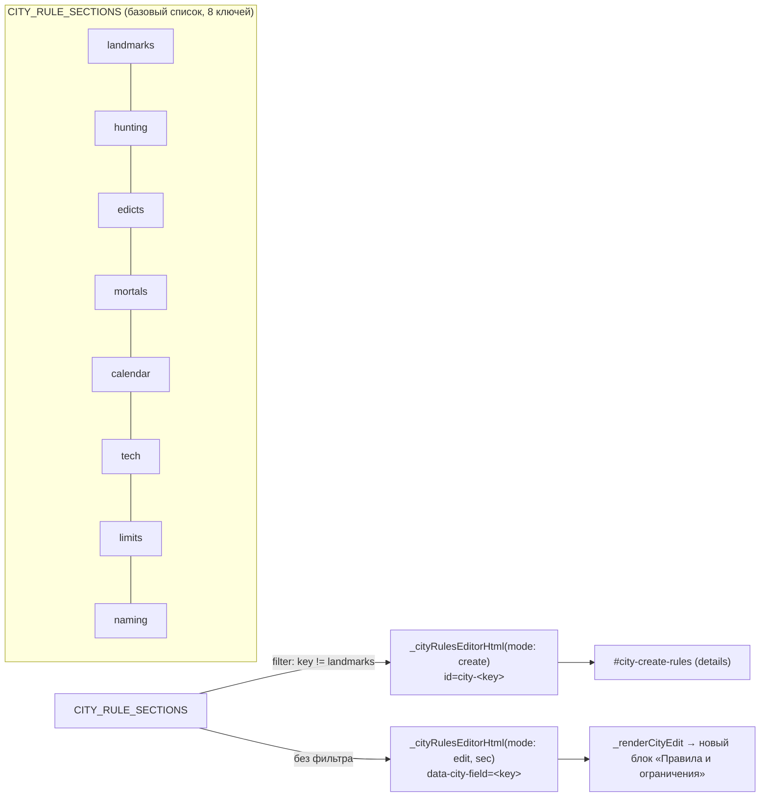

# Техспека: реструктуризация формы «Создать новый домен»

**Дата:** 2026-08-04 · **Роль:** Системный аналитик · **База:** [workplan](2026-08-04-city-create-form-restructure-workplan.md) (T1–T5)

Открытые вопросы workplan'а (риски №1–3) сняты по умолчанию — решения зафиксированы
в контрактах ниже; если пользователь на реализации скажет иначе, поправить точечно.

---

## Сквозной технический контекст (важно для T4/T5)

`#page-city` (просмотр/редактирование существующего города) и `#page-city-new`
(форма создания) — это **два разных `<section>`, но оба присутствуют в DOM
одновременно** (видимость переключает CSS-класс `.page`/`.active`, не
удаление узла). Поэтому у формы создания и формы редактирования сегодня
**намеренно разные стратегии адресации полей**, чтобы не столкнуться:

- форма создания (`_cityRulesEditorHtml`, инжектится один раз в
  `loadCitiesGrid()`) — адресация через `id="city-${key}"`, сбор payload в
  `scripts.js` через `document.getElementById(...)`;
- форма редактирования (`_renderCityEdit`, перерисовывается заново при
  каждом открытии) — адресация через `data-city-field="${key}"`, сбор в
  `_saveCityEdit()` через `document.querySelector('[data-city-field="..."]')`.

T5 переиспользует `_cityRulesEditorHtml` для формы редактирования — это
значит функция должна научиться отдавать **оба варианта разметки** по
режиму, не только объединить их (иначе — коллизия `id`/двойное срабатывание
`querySelector`, берущего первый попавшийся узел в документе). Контракт —
в §T4-T5 ниже.



---

## T1 · Скрыть «Политический ландшафт» из формы создания

**Бизнес-смысл:** на старте города обычно ещё нет расклада сил — поле
пустует и просто занимает место. Секция полностью доступна сразу после
создания через редактирование.

**Предусловия:** нет (чистая правка разметки).

**Поток:**
1. Из `web/public/index.html`, `#city-create-spoiler`, удалить блок
   `<div class="city-create-section-label">Политический ландшафт…</div>`
   и следующий `<div id="city-political-editor"></div>` (текущие строки
   938–939).
2. `scripts.js`: `_cityPoliticalCreateHost` (`getElementById('city-political-editor')`)
   станет всегда `null` — существующий тернарник
   `_cityPoliticalCreateHost ? _collectPoliticalRows(...) : ''` уже
   обрабатывает это корректно, правка не нужна.
3. `city.js`, `loadCitiesGrid()`: блок лениво-инжектящий
   `_cityPolEditorHtml({})` в `_cityPoliticalCreateHost` (строки 34–37)
   становится мёртвым (host всегда `null`, `if` не выполнится) — оставить
   как есть, никакого вреда; **не удалять** `_cityPolEditorHtml` саму
   функцию — она используется формой редактирования.

**Данные:** `POST /api/cities` payload лишается ключа `political`. Сервер
уже трактует отсутствующий/пустой `political` как `- …` (см.
`buildCityMd`/`_citySection`) — правок бэкенда не требуется.

**Обработка ошибок:** нет новых веток ошибок.

**Краевые случаи:** ни один — поле и раньше было необязательным для
заполнения (пустая секция допустима).

**Приёмка:**
- Форма создания не содержит поля/меток «Политический ландшафт».
- Создание города без этого поля проходит успешно, `city.md` содержит
  `## Политический ландшафт\n- …`.
- В карточке созданного города (просмотр → редактирование) поле
  «Политический ландшафт» присутствует и редактируется как раньше.

---

## T2 · Скрыть «География» (районы) из формы создания

**Бизнес-смысл:** районы как самостоятельные сущности (карточка +
`district.md`) заводятся тем же UI постфактум (`POST/PUT/DELETE
/api/cities/:slug/districts`, реализовано ранее, §A3–A5) — дублировать этот
функционал в форме создания не нужно, он только удлиняет форму на этапе,
когда районов чаще всего ещё нет.

**Предусловие:** подтверждено — пакетное создание N районов одним действием
при создании города теряется; после создания район добавляется по одному
через карточки на странице города (не более одного лишнего клика на район).

**Поток:**
1. `index.html`: удалить `<div class="city-create-section-label">География…</div>`
   и `<div id="city-districts-editor"></div>` (строки 940–941).
2. `scripts.js`, обработчик `#btn-new-city` — убрать как мёртвый код (не
   оставлять «на всякий случай», раз узла больше не будет):
   - сбор `districts`/предупреждение о дублирующихся слагах (строки
     1760–1766);
   - ключ `districts: districts.map(d => d.name).join(',')` в payload
     (строка 1790);
   - post-creation цикл `for (const dist of districts) { POST
     /api/cities/:slug/districts … }` и связанный `districtFailures`/toast
     (строки 1807–1819).
3. `city.js`, `loadCitiesGrid()`: ленивый инжект `_cityDistrictsEditorHtml()`
   в `_cityDistrictsCreateHost` (строки 30–33) — host всегда `null`, блок
   не выполняется; оставить (тот же случай, что T1 п.3).

**Данные:** `POST /api/cities` payload лишается ключа `districts`.
`cityScaffold` (`web/lib/parsers/city.js`) уже поддерживает пустой/отсутствующий
`districts` — уходит в ветку `else keepDirs.push('locations')`, создающую
только пустую `locations/` без районных подпапок. Правок бэкенда не
требуется.

**Обработка ошибок:** исчезает как класс — весь удаляемый код в п.2 был
обработкой ошибок именно district-при-создании сценария.

**Краевые случаи:**
- Город без единого района — уже штатный, поддерживаемый путь (сегодня
  тоже можно создать город без районов, просто оставив список пустым).
- Первый район города пользователь заводит сразу после редиректа на
  страницу нового города — карточка района там уже работает (существующий
  функционал, без изменений).

**Приёмка:**
- Форма создания не содержит поля/меток «География»/район-карточек.
- Payload `POST /api/cities` не содержит ключ `districts`.
- Создание города проходит успешно, `locations/` создаётся пустой (без
  district-подпапок).
- На странице созданного города доступна кнопка добавления района, район
  создаётся и появляется в `## Районы` city.md (уже работающий путь,
  регрессия недопустима).

---

## T3 · Выделить «Лейтмотивы / Специфика / Чего избегать / Источники» в раздел «Голос и стиль хроники»

**Бизнес-смысл:** эти 4 поля формируют, как Рассказчик говорит о городе с
первой же сцены — в отличие от «Правил и ограничений» (механические
лимиты генерации), это не опциональный тюнинг, а основа тона. Нужен общий
заголовок, но **не** сворачивание в `<details>`.

**Предусловие:** нет.

**Поток:**
1. В `index.html` обернуть 4 существующих `.form-group`
   (`city-leitmotif`/`city-specifics`/`city-avoid`/`city-sources`, текущие
   строки 944–959) в контейнер с тем же паттерном разметки, что уже
   применяется к «Политическому ландшафту»/«Географии»:
   ```html
   <div class="city-create-section-label">Голос и стиль хроники<span class="field-tip" ...>ⓘ</span></div>
   <div class="form-group">…leitmotif…</div>
   <div class="form-group">…specifics…</div>
   <div class="form-group">…avoid…</div>
   <div class="form-group">…sources…</div>
   ```
   (Обёртка — обычный `<div>`, не `<details>`: раздел остаётся полностью
   развёрнутым и видимым по умолчанию.)
2. Подсказка (`data-tip`) для нового заголовка — коротко перечисляет, что
   входит: «Лейтмотивы, специфика ответа, что избегать, источники —
   формируют голос Рассказчика для этого города».
3. JS не меняется — `id`-based сбор в `scripts.js` (`city-leitmotif` и т.д.)
   не завязан на структуру обёртки.

**Данные / ошибки / краевые случаи:** без изменений — только визуальная
группировка, ни один ключ payload не переименовывается и не перемещается.

**Приёмка:**
- 4 поля визуально сгруппированы под одним заголовком, без `<details>`
  (сразу видны, не нужно раскрывать).
- Значения полей сохраняются в `city.md` в тех же секциях, что раньше
  (`## Лейтмотивы и атмосфера` и т.д.) — регрессионная проверка round-trip.

---

## T4 · Скрыть «Ключевые локации» и «Значимые места» из формы создания

**Бизнес-смысл:** оба поля описывают конкретные точки города — материал,
которого на этапе создания почти никогда ещё нет (сначала обычно заводят
районы и локации по одной через отдельный UI, а не общим списком). Термин
пользователя «Отмеченные локации» = секция `landmarks` («Значимые места»)
— зафиксировано по смыслу («знаковые, отмеченные точки города»); если
имелось в виду иное — поправить перед реализацией.

**Предусловие:** ни то, ни другое поле не участвует в физическом создании
папок (в отличие от districts) — их скрытие из формы создания не имеет
побочных эффектов на структуру каталогов.

**Поток:**
1. `index.html` — удалить блок «Ключевые локации» целиком: заголовок
   `<div class="city-create-section-label">Значимые места города…</div>`
   (ошибочная метка — см. риск №3 workplan'а, снимается вместе с блоком) +
   `<div id="city-locations-editor"></div>` (текущие строки 942–943).
   *(Не путать с T3 — блок с текущей меткой «Значимые места города» —
   это ключ `locations`/«Ключевые локации», не `landmarks`.)*
2. `city.js`, `CITY_RULE_SECTIONS` — ввести:
   ```js
   const CITY_RULE_SECTIONS = [
     ['landmarks', 'Значимые места'],
     ['hunting',   'Охотничьи угодья'],
     ['edicts',    'Законы домена'],
     ['mortals',   'Смертные институции'],
     ['calendar',  'Календарь города'],
     ['tech',      'Технологии и Маскарад'],
     ['limits',    'Ограничения генерации'],
     ['naming',    'Именник и фактура'],
   ];
   // landmarks заводится только после создания города — через
   // просмотр/редактирование (T4/T5); форма создания его не показывает.
   const CITY_RULE_SECTIONS_CREATE = CITY_RULE_SECTIONS.filter(([key]) => key !== 'landmarks');
   ```
   Один базовый список + фильтр — не два независимых литерала (иначе они
   разойдутся при следующем добавлении новой секции правил, тот же класс
   проблемы, что раньше правили для `CITY_SECTIONS`).
3. `_cityRulesEditorHtml` — рендер формы создания переключить на
   `CITY_RULE_SECTIONS_CREATE` (сигнатура и режимы — единый контракт с T5,
   см. ниже).
4. `scripts.js`, `#btn-new-city` — `Object.fromEntries(CITY_RULE_SECTIONS.map(...))`
   заменить на `CITY_RULE_SECTIONS_CREATE.map(...)` (сегодня это безопасно
   и без правки за счёт `?.trim() || ''`, но оставлять обращение к
   заведомо отсутствующему `city-landmarks` — источник путаницы при чтении
   кода; явный список честнее).

**Данные:** `POST /api/cities` payload лишается ключей `locations` и
`landmarks`. Обе секции в `buildCityMd` уже опциональны (`- …` по
умолчанию) — бэкенд не меняется.

**Обработка ошибок:** нет новых веток.

**Краевые случаи:**
- Город с рукописным (нестандартным) `city.md`, где `## Значимые места`
  уже что-то содержит из прошлого — не затрагивается: T4 только про форму
  создания НОВОГО города, `PUT /api/cities` (редактирование) секцию не
  трогает, если не изменилась (правило «unchanged section skip», уже
  реализовано).

**Приёмка:**
- Форма создания не содержит полей «Ключевые локации» и «Значимые места»
  (в т.ч. внутри свёрнутого «Правила и ограничения» — landmarks там больше
  нет).
- Payload `POST /api/cities` не содержит ключи `locations`, `landmarks`.
- В форме редактирования оба поля присутствуют и работают как раньше
  (landmarks — внутри группы «Правила и ограничения», см. T5; locations —
  структурный редактор `_cityLocEditorHtml`, без изменений).

---

## T5 · Раздел «Правила и ограничения города» в просмотре и редактировании

### Просмотр (`_renderCityView`)

**Решение:** без изменений кода. `_renderCityView` уже рендерит весь
`city.md` как единый markdown (`mdToHtmlBlock(body)`) — все 8 заголовков
секции правил («Значимые места», «Охотничьи угодья» и т.д.) уже
физически отображаются, каждый под своим `##`-заголовком. Формальное
требование «отображать в просмотре» выполнено существующим кодом.

Косметическое выделение в отдельную визуально обособленную панель —
необязательный follow-up, не входит в этот цикл (не влияет на данные,
чисто внешний вид; делать отдельным заходом при отдельном запросе).

**Приёмка:** открыть просмотр любого города с непустыми полями правил →
все 8 заголовков видны в теле карточки (уже сегодня так, регрессионный
чек, не новая функциональность).

### Редактирование (`_renderCityEdit`)

**Бизнес-смысл:** сейчас 8 ключей правил рендерятся плоским циклом
вперемешку со всеми остальными полями без какой-либо визуальной
группировки — хуже, чем форма создания (там они хотя бы в одном
`<details>`). Нужно визуальное единообразие с формой создания.

**Предусловие:** T4 выполнен (общий `CITY_RULE_SECTIONS`/`CITY_RULE_SECTIONS_CREATE`
контракт уже введён).

**Технический контракт — `_cityRulesEditorHtml`, единая функция для обоих режимов:**

```js
// mode: 'create' → id="city-<key>", пустое значение (форма создания не
//   предзаполняется); 'edit' → data-city-field="<key>", значение из sec[key].
// Разные атрибуты адресации — не косметика: #page-city и #page-city-new
// сосуществуют в DOM одновременно (видимость через CSS), совпадающие id
// дали бы коллизию (см. «Сквозной технический контекст» выше).
function _cityRulesEditorHtml(mode = 'create', sec = {}) {
  const sections = mode === 'edit' ? CITY_RULE_SECTIONS : CITY_RULE_SECTIONS_CREATE;
  return sections.map(([key, heading]) => {
    const attr = mode === 'edit' ? `data-city-field="${key}"` : `id="city-${key}"`;
    const value = mode === 'edit' ? escHtml(sec[key] || '') : '';
    const forAttr = mode === 'edit' ? '' : ` for="city-${key}"`;
    return `
    <div class="form-group">
      <label class="form-label"${forAttr}>${escHtml(heading)}${fieldTip(CITY_FIELD_TIPS[heading])}</label>
      <textarea class="form-control" ${attr} rows="2" placeholder="По строке на пункт…">${value}</textarea>
    </div>`;
  }).join('');
}
```

Вызов из формы создания (`loadCitiesGrid()`) меняется с
`_cityRulesEditorHtml()` на `_cityRulesEditorHtml('create')` — поведение
идентично текущему (пустые поля, `id`-адресация).

**Поток (`_renderCityEdit`):**
1. Из цикла `fieldRows = CITY_SECTION_DEFS.map(...)` (строки 930–944)
   исключить 8 ключей `CITY_RULE_SECTIONS` (проверка `if
   (CITY_RULE_SECTIONS.some(([k]) => k === key)) return '';` рядом с уже
   существующими исключениями `political`/`factions`/`locations`/`districts`).
2. В месте композиции `content.innerHTML` (после `${fieldRows}`, строка 975)
   добавить свёрнутый блок в том же паттерне, что и форма создания:
   ```html
   <details class="city-create-spoiler city-create-subspoiler">
     <summary>Правила и ограничения города</summary>
     ${_cityRulesEditorHtml('edit', sec)}
   </details>
   ```
   (Без «(необязательно)» в заголовке — в контексте редактирования это не
   обязательность заполнения при первом вводе, а просто сворачиваемая
   группа; оставить нейтральную подпись «Правила и ограничения города».)

**Данные / сбор при сохранении (`_saveCityEdit`):** **правок не требуется.**
Цикл `for (const [key] of CITY_SECTION_DEFS) { … else fields[key] =
q(key).value.trim(); }` ищет `data-city-field` по всему документу
(`document.querySelector`), независимо от того, в какой обёртке лежит
элемент — вложенность в новый `<details>` физического значения не имеет,
раз атрибут `data-city-field="${key}"` сохранён (это и обеспечивает
контракт `mode='edit'` выше).

**Обработка ошибок:** без изменений — сохранение города обрабатывает
ошибки на уровне всей формы, не по отдельным секциям.

**Краевые случаи:**
- Свёрнутый `<details>` по умолчанию — открыт или закрыт при входе в
  режим редактирования? Решение: **закрыт по умолчанию**, симметрично
  форме создания (`#city-create-rules` тоже closed-by-default) — если у
  города уже ЕСТЬ данные в одном из этих 8 полей, пользователь всё равно
  видит это в режиме просмотра до перехода в редактирование; при
  редактировании — та же логика "не обязательно смотреть, если не нужно".
- Нестандартный (рукописный) `city.md` с доп. секциями (`custom`,
  `_cityCustomSections`) — не пересекается с этим блоком, продолжает
  показываться отдельным предупреждением, как сегодня.

**Приёмка:**
- В форме редактирования 8 ключей правил визуально сгруппированы в один
  `<details>` «Правила и ограничения города», отдельно от остальных полей.
- Существующие значения полей (например, у Парижа — `## Именник и
  фактура`/`## Технологии и Маскарад` и т.д., если заполнены) корректно
  предзаполняются в textarea при открытии редактирования.
- Сохранение города с изменённым значением одного из 8 полей проходит,
  `PUT /api/cities` получает корректный `fields.<key>`, `city.md`
  обновляется точечно (без затрагивания остальных секций — уже
  гарантировано существующей логикой `city_md_writer.js`).
- Форма создания (`_cityRulesEditorHtml('create')`) визуально и
  функционально не изменилась (кроме отсутствия `landmarks`, см. T4).

---

## Порядок реализации (уточнение workplan'а)

1. **T1, T2, T3** — независимо, в любом порядке, каждая — самодостаточный PR/коммит.
2. **T4 → T5** — строго последовательно в одном заходе: T4 вводит
   `CITY_RULE_SECTIONS`/`CITY_RULE_SECTIONS_CREATE` и режим `'create'` у
   `_cityRulesEditorHtml`; T5 добавляет режим `'edit'` той же функции и
   новый блок в `_renderCityEdit`. Разносить по разным коммитам не имеет
   смысла — T5 без T4 негде подключать (`CITY_RULE_SECTIONS` с landmarks
   ещё не отделён от create-версии).

## Общая приёмка цикла

- `npm run test:all` — 0 регрессий (существующие тесты форм создания/
  редактирования города, если затрагивают точные ключи payload —
  `factions`/`political`/`locations`/`landmarks`/`districts` — актуализировать
  под новый набор полей формы создания).
- Ручная проверка в браузере (headless CDP, `run-sanguine-web`): полный
  цикл создать город → без political/districts/locations/landmarks в
  форме → создание проходит → на странице города все 4 поля видны и
  редактируются → в «Правила и ограничения» редактирования landmarks
  редактируется и сохраняется отдельно от hunting/edicts/…
- `cities/paris/city.md` — MD5 не меняется ни на одном шаге проверки
  (эта задача не трогает существующие города).
