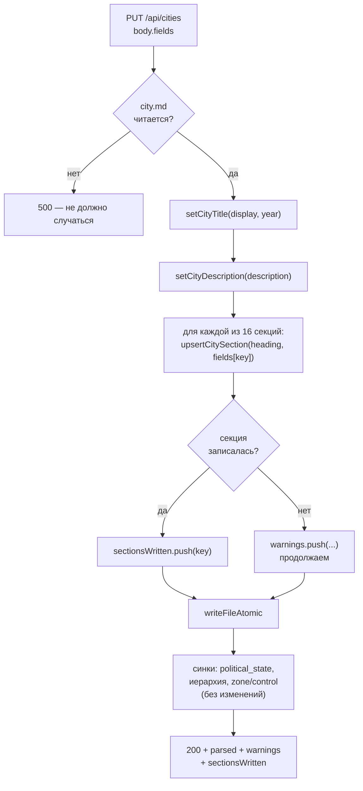
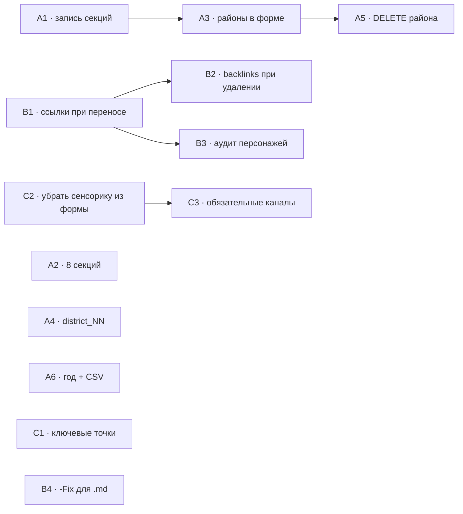

# Техспека раздела «Города» — контракты для Разработчика

> Роль-автор: **Системный аналитик**. Адресат: **Разработчик**.
> Вход: [`2026-08-04-city-section-workplan.md`](2026-08-04-city-section-workplan.md) (роль «Аналитик»).
> Дата: 2026-08-04. Статус: **контракты готовы, разработка не начата.**

Нумерация пунктов (A1, A2, …) сквозная с планом работ — не переименовывать.
Решения по открытым вопросам плана (ОВ-1…ОВ-5) приняты в §8 этого документа.

---

## A1. Точечная запись секций `city.md` вместо полного ребилда 🔴

### A1.1 Бизнес-смысл

`PUT /api/cities` с `fields` сегодня выполняет `cityMd = buildCityMd(b.fields)` —
полный ребилд файла из 16 канонических секций. Любая рукописная секция и любое
форматирование за пределами простого буллет-списка уничтожаются. Из-за этого
фронтенд вынужден **запрещать** структурное редактирование городам с
нестандартными секциями (`_cityHasCustomSections` → `disabled` на вкладке
«Поля»), и основной город пользователя (Париж) правится только сырым markdown.

Цель: сделать запись **идемпотентной по не-затронутым частям файла** — писать
только то, что реально пришло, и снять запрет.

### A1.2 Предусловия

- `city.md` существует и начинается с `# …` (проверка уже есть, оставить).
- Приходит `body.fields` (объект). Ветка `body.cityMd` (вкладка Markdown) **не
  меняется** — там запись «как есть» и это корректно.

### A1.3 Новый модуль — контракт

Вынести из `web/routes/archive.js:97` и обобщить. Расположение:
**`web/lib/city_md_writer.js`** (новый файл). Причина не класть в
`lib/parsers/city.js` — тот отвечает за чтение/сборку, здесь же — мутации
существующего текста; плюс `parsers/index.js` реэкспортирует всё подряд, а этот
модуль нужен точечно серверу и `tools/`.

```js
/**
 * Заменяет ТЕЛО секции `## heading` произвольным текстом. Не трогает ничего
 * за пределами тела секции (соседние секции, H1, интро, форматирование).
 * @returns {string|null} новый текст, либо null если заголовок не найден
 */
function replaceCitySection(raw, heading, bodyText)

/**
 * То же, но при отсутствии секции ВСТАВЛЯЕТ её в каноническое место
 * (см. A1.5 «Правило вставки»).
 * @returns {string} всегда строка
 */
function upsertCitySection(raw, heading, bodyText)

/** Переписывает H1: `# {display}, {year} — сеттинг города`. */
function setCityTitle(raw, display, year)

/** Заменяет абзац между H1 и первой `## ` секцией. */
function setCityDescription(raw, text)

/** Обратно-совместимая обёртка для синка списков (Фракции/Районы). */
function replaceCitySectionBullets(raw, heading, names /* string[] */)
```

**Отличие от текущей `_replaceCitySection`:** та принимает `bulletLines: string[]`
и всегда рендерит буллет-список. Форме редактирования нужно писать **произвольный
многострочный текст** (пользователь может ввести прозу, таблицу, что угодно),
поэтому базовой становится `bodyText: string`, а буллет-вариант — обёрткой над ней.

`replaceCitySectionBullets(raw, h, names)` ≡
`replaceCitySection(raw, h, names.length ? names.map(n => '- ' + n).join('\n') : '- …')`.

**Регулярка секции остаётся прежней** (проверена на реальных данных):
```js
new RegExp(`(^##\\s+${esc}\\s*\\n)([\\s\\S]*?)(?=\\n##\\s+|(?![\\s\\S]))`, 'm')
```
`(?![\s\S])` — истинный конец строки; `$` с флагом `m` здесь ломается (матчит
конец каждой строки). **Не заменять на `$`.**

### A1.4 Поток записи `PUT /api/cities` (ветка `fields`)



Ключевое отличие от текущего кода: файл **читается перед записью** и правится
инкрементально, а не собирается с нуля. Рукописные секции («Уточняющие вопросы
перед написанием сценария (Париж)») в цикле не участвуют и остаются нетронутыми.

### A1.5 Правило вставки отсутствующей секции

`upsertCitySection` при отсутствии `## heading`:

1. Определить позицию `heading` в `CITY_SECTIONS` (канонический порядок).
2. Идти **назад** по `CITY_SECTIONS` от этой позиции, искать первую секцию,
   которая в файле **есть** → вставить новую сразу ПОСЛЕ её тела.
3. Если предшествующих нет — вставить сразу ПОСЛЕ блока описания (перед первой
   существующей `## `).
4. Если в файле вообще нет `## ` — дописать в конец.

Формат вставки: `\n## {heading}\n{bodyText}\n`. Разделители `---` **не
добавлять** — `buildCityMd` их не генерирует, а в рукописных файлах они уже
расставлены пользователем.

### A1.6 Обработка ошибок и краевые случаи

| Случай | Поведение |
|---|---|
| Секции нет в файле | вставить по A1.5; в `sectionsWritten` пометить как созданную |
| `fields[key] === undefined` (ключ не пришёл) | секцию **не трогать** вообще |
| `fields[key] === ''` (пришёл пустой) | записать плейсхолдер `- …` (эквивалент «очистить») |
| Дубль заголовка `## X` в файле | правится **первое** вхождение; в `warnings` — предупреждение |
| Заголовок с разным регистром | матчинг регистронезависимый (как в `parseCityMd`) |
| `display`/`year` не пришли | H1 не трогать |
| BOM в начале файла | снять перед обработкой, вернуть при записи (как в `fixLinks` миграции 002) |

**Инвариант, обязательный к проверке тестом:** при `PUT` с `fields`, где все 16
секций равны их текущему распарсенному значению, файл на диске **не должен
измениться байт-в-байт** для канонического города и **не должен потерять
рукописные секции** для Парижа.

### A1.7 Снятие блокировки вкладки «Поля»

После A1 — `web/public/scripts/city.js`:
- убрать `disabled` и `title` с кнопки `[data-city-tab="fields"]`;
- `_cityHasCustomSections()` **оставить**, но переключить на информирование:
  при `true` показывать над формой плашку `.canon-warn` вида «У города есть
  свои секции (перечислить) — они сохранятся без изменений»;
- вкладка «Markdown» остаётся как есть.

### A1.8 Приёмочные тесты

1. Париж (рукописный): сохранение формы не теряет «Уточняющие вопросы…»,
   не ломает таблицы/блок-цитаты/`###`-подзаголовки в «Ключевые локации».
2. Идемпотентность: два одинаковых `PUT` подряд → файл не меняется после первого.
3. Вставка: город без «Фракции» получает секцию в каноническом месте (перед
   «Политический ландшафт»).
4. Очистка: `fields.limits = ''` → в файле `- …`, `parseCityMd` даёт `''`.
5. Регресс §11: синк фракций (`_syncCityFactionsList`) продолжает работать —
   перевести его на `replaceCitySectionBullets` из нового модуля, дубль удалить.

### A1.9 Риск

Правка пути записи главного файла города. Прецедент: §11 техспеки — полный
ребилд уже разрушал `paris/city.md`. **Не мёржить без прогона на копии Парижа**
и без п.1 приёмочных тестов.

---

## A2. Восемь «живых» секций в `POST /api/cities` 🔴

### A2.1 Backend — контракт

`web/routes/cities.js`, вызов `cityScaffold({...})` — добавить недостающие ключи:

```js
const { files, keepDirs } = cityScaffold({
  display, year,
  description: b.description, factions: b.factions,
  political: b.political, locations: b.locations, leitmotif: b.leitmotif,
  specifics: b.specifics, avoid: b.avoid, sources: b.sources,
  districts: b.districts,
  // ── добавить: ────────────────────────────────────────────
  landmarks: b.landmarks, hunting: b.hunting, edicts: b.edicts,
  mortals: b.mortals, calendar: b.calendar, tech: b.tech,
  limits: b.limits, naming: b.naming,
});
```

Изменений в `cityScaffold`/`buildCityMd` **не требуется** — они уже итерируют
`CITY_SECTIONS` и берут `fields[key]`; сегодня просто получают `undefined`.

Валидация: не нужна (свободный текст, как у прочих секций). Санитизация — по
уже действующему для секций правилу (см. FIX-16, `sanitizeFreeformBody` там, где
это применяется к остальным секциям; если для секций города санитизации сейчас
нет — не вводить её в этом пункте, чтобы не менять поведение остальных 8).

### A2.2 UI — контракт (решение ОВ-1, см. §8)

`web/public/index.html`, форма `#city-create-spoiler` — добавить перед кнопкой
«Создать домен» сворачиваемый блок:

```html
<details class="city-create-subspoiler" id="city-create-rules">
  <summary>Правила и ограничения города (необязательно)</summary>
  <!-- 8 textarea, id по образцу существующих: city-landmarks, city-hunting,
       city-edicts, city-mortals, city-calendar, city-tech, city-limits, city-naming -->
</details>
```

`web/public/scripts/scripts.js`, обработчик `#btn-new-city` — добавить 8 полей в
`payload` тем же способом, что уже используется для `leitmotif`/`specifics`/…:
`landmarks: document.getElementById('city-landmarks').value.trim()` и т.д.

Подсказки (`.field-tip`) — переиспользовать формулировки из `CITY_FIELD_TIPS`
(`city.js`), они уже написаны для формы редактирования; дублировать текст руками
не нужно, вынести в общий источник либо сослаться на тот же объект.

### A2.3 Приёмочные тесты

1. `POST /api/cities` со всеми 16 секциями → `parseCityMd` возвращает все 16
   непустыми (сегодня 8 молча теряются).
2. `buildCityConstraints(slug)` и `buildCityNaming(slug)` для такого города —
   непустые (сегодня пустые).
3. UI: заполнение блока «Правила и ограничения» → значения в `city.md`.

---

## A3. Раздел «Районы» в форме редактирования города 🔴 (после A1)

### A3.1 Компонент — режим «существующая сущность»

Переиспользовать `_districtCardHtml(d, factionNames)` (`city.js:376`). Добавить
третий аргумент-опции:

```js
_districtCardHtml(d, factionNames, { mode: 'create' | 'edit', slug })
```

| Аспект | `mode: 'create'` (сегодня) | `mode: 'edit'` (новый) |
|---|---|---|
| Значения | пустой шаблон | из `GET /api/cities/:slug/districts` |
| Сохранение | пачкой, после `POST /api/cities` | своя кнопка на карточку → `PUT .../districts/:slug` |
| Кнопка удаления | убирает карточку из DOM | `DELETE .../districts/:slug` (см. A5) |
| `data-district-slug` | нет | есть, из ответа `GET` |

`_collectDistrictCards(root)` собирает ВСЕ карточки разом — для `edit` нужна
`_collectDistrictCard(cardEl)` на одну карточку. Старую **не менять** (её
использует форма создания).

### A3.2 Синк секции «## Районы» — односторонний

**Решение (ОВ-2):** `district.md` — единственный источник истины; секция
«## Районы» в `city.md` — **производное зеркало**, перестраивается целиком при
любой мутации района.

- Формат строки: **только имя района**, по буллету на район — та же конвенция,
  что у «Фракции». Тип/секта/клан **не дублировать**: они живут в `district.md`,
  дубль создал бы второй источник истины.
- Порядок: как отдаёт `GET /districts` (сортировка по имени, `localeCompare('ru')`).
- Ручные правки секции при следующей мутации района **перезаписываются** — это
  осознанное следствие «зеркала», задокументировать в подсказке поля.

```js
/** Перестраивает «## Районы» из district.md-сущностей. Non-blocking. */
async function syncCityDistrictsList(citySlug) // → warning: string|null
```

Вызывается из `POST`, `PUT`, `DELETE` `/api/cities/:slug/districts` **после**
успешной записи `district.md`. Реализация — `replaceCitySectionBullets` из A1.3.

Семантика ошибок — ровно как у `_syncCityFactionsList` (§11): не бросает, не
откатывает уже сохранённый район, возвращает текст предупреждения, который
роутер кладёт в `warning` ответа.

### A3.3 Что НЕ делать

Привязку/создание локаций в форму редактирования **не добавлять** — обе операции
уже работают на странице просмотра, куда `_saveCityEdit()` возвращает
пользователя автоматически (`_renderCityView()`, `city.js:1033`). Решение
Аналитика, план §15.4.

### A3.4 Приёмочные тесты

1. Правка типа/влияния/описания существующего района через форму → `district.md`
   обновлён, слаг папки не изменился.
2. Создание района у существующего города → папка + `district.md` + строка в
   «## Районы».
3. Секция «## Районы» после мутации содержит ровно имена из `GET /districts`.
4. Город без секции «## Районы» → она создаётся (через `upsertCitySection`).

---

## B1. Обновление ссылок при переносе локации 🔴

### B1.1 Вынос функции

Из `tools/migrations/002_district_rayon_paths.js:141-172` в
**`web/lib/md_links.js`** (новый файл; `tools/` и `web/` оба его импортируют).

```js
/**
 * Правит markdown-ссылки «locations/<oldRel>» → «locations/<newRel>» во всех
 * .md файлах города, на любой глубине «../». BOM сохраняется.
 * @param {string}   cityDir     абсолютный путь cities/<city>
 * @param {{oldRel:string,newRel:string}[]} renameMap  пути ОТНОСИТЕЛЬНО locations/
 * @param {(msg:string)=>void} [log]
 * @returns {{filesChanged:number, files:string[]}}
 */
function updateLocationLinks(cityDir, renameMap, log)
```

Логику **не переписывать**: сортировка `renameMap` по убыванию длины `oldRel`
(чтобы короткий префикс не перекрыл длинный), граница `(?=[/)]|$)`, обработка BOM
— всё уже корректно и проверено на боевой миграции. Миграция 002 после выноса
импортирует ту же функцию (дубль удалить).

### B1.2 Вызов из `PUT /api/locations/:slug/district`

После успешного `fs.rename` и записи `**Округ:**`:

```js
let linksUpdated = 0, linkWarning = null;
try {
  const r = updateLocationLinks(cityDir(city), [{ oldRel, newRel }]);
  linksUpdated = r.filesChanged;
} catch (e) {
  linkWarning = `Локация перенесена, но ссылки на неё обновить не удалось: ${e.message}`;
}
```

где `oldRel = '<oldDistrictSlug>/<locSlug>'`, `newRel = '<newDistrictSlug>/<locSlug>'`.

**Расширение ответа** (обратно совместимо, поля добавляются):

```jsonc
{
  "ok": true,
  "movedFrom": "villet/sklad_kanal_yurk",
  "movedTo":   "antrepo/sklad_kanal_yurk",
  "linksUpdated": 1,          // NEW — сколько файлов поправлено
  "warning": "…"              // NEW, опционально — если фикс ссылок упал
}
```

Фронтенд `_attachLocationToDistrict()` — показать `warning` тостом (механизм уже
есть) и упомянуть `linksUpdated` в success-тосте, если > 0.

### B1.3 Краевые случаи

| Случай | Поведение |
|---|---|
| Перенос в тот же район (§9.3 no-op) | `updateLocationLinks` **не вызывать** |
| Входящих ссылок нет | `linksUpdated: 0`, не ошибка |
| Ссылка в файле ДРУГОГО города | не трогаем — обход ограничен `cityDir` (кросс-city ссылки на локации в проекте не приняты) |
| Глубина вложенности | не меняется (`locations/<район>/<локация>/` в обоих случаях) → исходящие ссылки внутри карточки чинить **не нужно** |

### B1.4 Приёмочные тесты

1. Локация с входящей ссылкой из модуля → после переноса `validate_links` чист,
   `linksUpdated === 1`.
2. Ссылки на ДРУГИЕ локации в том же файле не тронуты.
3. Файл с BOM переживает правку без потери BOM.
4. Миграция 002 после выноса функции работает как раньше (её тесты зелёные).

---

## A4. Убрать фантомные `district_NN/` из `cityScaffold` 🟡

**Дефект:** `cityScaffold` (`lib/parsers/city.js:206-219`) создаёт обёртки
`locations/district_NN/<slug>/`, отменённые §8. При создании города через UI
получаются две папки на район: фантомная с `.gitkeep` и настоящая с `district.md`.

**Контракт:** заменить блок на плоское `keepDirs.push('locations/' + dslug)`,
сохранив дедуп по слагу и фолбэк `locations` при пустом списке. Нумерация
`district_NN` уходит полностью.

**Миграция-уборка (решение ОВ-5, уточнено при реализации): не нужна.** Проверено
прогоном `find … -path "*/district_*"` по `cities/paris`, `cities/balmont` и
остальным реальным городам в репозитории — фантомных `district_NN/` не нашлось
ни в одном. Баг материализовался только для городов, создаваемых через UI ПОСЛЕ
того, как районы (§2 техспеки) стали отдельной сущностью — то есть только во
время этой сессии, и только в одноразовых тестовых городах, удалённых сразу
после проверки. Реальных данных пользователя это не касалось. Если фантомная
обёртка когда-нибудь обнаружится в чьих-то данных — миграция всё ещё может
понадобиться, но писать её сейчас, без единого реального случая для проверки,
преждевременно.

**Реализовано:** `keepDirs.push('locations/' + dslug)` вместо
`locations/district_${NN}/${dslug}`, дедуп по слагу сохранён, фолбэк `locations`
при пустом списке — без изменений. `tools/new_city.js` использует тот же
`cityScaffold`, правки не требует (source-guard-тест это проверяет).

**Тесты:** создание города с районами → ровно одна плоская папка на район, без
`district_NN` в пути.

---

## A5. `DELETE` района 🟡 (после A3)

**Новый эндпоинт:** `DELETE /api/cities/:slug/districts/:districtSlug`.

**Решение ОВ-4 — запрет удаления непустого района:**

| Условие | Ответ |
|---|---|
| Город/район не найден | `404` |
| Слаг не `^[a-z0-9_]+$` | `400` |
| В районе есть папки локаций | `409` + `{ error: "В районе «X» есть локации (N) — перенесите или удалите их сначала", locations: [slug…] }` |
| Район пуст (только `district.md`) | `200` + удаление папки + `syncCityDistrictsList` |

Обоснование запрета вместо авто-переноса в «Другие»: перенос — это `fs.rename`
каждой локации плюс правка ссылок (B1) плюс правка `**Округ:**`; молча выполнять
цепочку побочных эффектов по одному клику «Удалить» опаснее, чем показать явную
ошибку. Тот же паттерн 409, что уже принят для коллизий slug (техспека §16.3).

**Удаление — мягкое или жёсткое:** мягкое, в `locations/_deleted/district_<slug>_<ts>/`,
симметрично `DELETE /api/locations/:slug`. Обходы локаций уже пропускают `_`-папки.

**UI:** кнопка удаления на карточке района в режиме `edit` (A3.1) + `showConfirm`
с текстом о необратимости.

---

## A6. Валидация года в `PUT`; CSV районов по буллетам 🟡

**A6.1 Год.** `PUT /api/cities/:slug`, ветка `fields`: применить то же правило,
что уже в `POST` — `/^\d{3,4}$/`, иначе `400 { error: 'Год — это 3–4 цифры (например 2010)' }`.
Пустой/непришедший `year` — не ошибка (H1 не трогаем, см. A1.6).
Сегодня `PUT` принимает `«не-год-вообще»` и пишет это в H1, откуда год расходится
по шапкам карточек.

**A6.2 CSV районов.** `buildCityMd` получает `fields.districts` тем же CSV, что
`cityScaffold` использует для папок, и `_citySection` кладёт его одной строкой
(`- Первый Ку,Второй Ку`). Исправить **в точке вызова**, не в `_citySection`:
`POST /api/cities` формирует для секции список по буллету на район
(`districts.split(',').map(s => s.trim()).filter(Boolean)`), а для `cityScaffold`
продолжает передавать CSV (тот сам разбирает). После A3 секция всё равно
перестраивается синком — этот пункт чинит только момент создания.

---

## B2. `DELETE` локации: предупреждать о входящих ссылках 🟡 (после B1)

**Новый read-only эндпоинт:** `GET /api/locations/:slug/backlinks?city=…`

```jsonc
{ "count": 3, "files": ["chronicles/…/module.md", "archive/timeline.md"] }
```

Реализация — тот же обход, что `updateLocationLinks` (B1.1), в режиме подсчёта
без записи: вынести общий `findLocationLinks(cityDir, rel)`.

**Фронтенд:** перед `DELETE` запросить backlinks; при `count > 0` в `showConfirm`
показать «На эту локацию ссылаются N файлов — ссылки станут битыми» + список
(первые 5). Решение оставить пользователю: удаление **не блокируется**.

Обоснование: цель удаляется, автоподстановка нового пути невозможна; снимать
ссылку, оставляя текст (как `-Fix` делает для изображений) — потеря информации
без ведома Рассказчика.

---

## C1. Форма «Ключевые точки» 🟡

**Фронтенд-only.** `locations.js`: `keyEditHtml` — вместо одной
`<textarea id="locdet-keys-ta">` список повторяемых строк с двумя полями
(«Место», «Описание») + «+ Добавить точку» + удаление строки. Образец — соседний
блок «Крючки» (`hooksEditHtml`, `locdet-hooks-edit-list`, `_renumberHooks`).

`_locSavePanel('keys')` — собрать строки в тот же pipe-формат
`| Место | Описание |` (по строке на точку). **Бэкенд и парсер не трогать**:
`PUT /fields` ключ `keyPoints` и `parseLocation` уже принимают этот формат.

Экранирование: `|` внутри значений сворачивать в `∣` (U+2223), как уже делает
`vtmTable` (`routes/locations.js`) — иначе колонки поедут.

**Тест:** round-trip — две точки с `|` в описании сохраняются и читаются обратно
без сдвига колонок.

---

## C2. Убрать «Сенсорную палитру» из формы локации 🟡

**Удалить:** блок `index.html:1313-1319` (label, `#loc-edit-sens-rows`, кнопка
«+ Добавить канал»); вызовы `_renderLocEditSensRows()`/`_collectLocEditSensRows()`
в `openLocEditModal()` и `saveLocEdit()` (обе ветки — создание и редактирование).

**Проверить на осиротелость** и удалить как мёртвый код, если не используются
больше нигде: `_locEditSensRowHtml`, `_renderLocEditSensRows`,
`_collectLocEditSensRows`, `LOC_EDIT_SENS_CHANNELS`, `_locEditSensSeq`, CSS-классы
`.loc-edit-sens-*`. **Оставить** `_sensRebuildTable` — его использует детальная
модалка.

**Не трогать:** обработчик `sensoryPalette` в `PUT /api/locations/:slug/fields` —
через него сохраняет детальная модалка (`_locSavePanel('sens-N')`).

**Следствие для UX:** сенсорика становится недоступна на этапе СОЗДАНИЯ локации
(заполняется после, в детальной модалке) — согласовано с пользователем,
план `loc-plan §6`.

---

## C3. Обязательные сенсорные каналы 🟡 (после C2)

**Решение ОВ-3 — вариант (i), UI-only.** Backend-валидацию (ii) не вводить:
она задним числом сделала бы невалидными существующие карточки (1 файл без
секции вообще, 3 с каналами «Зрение»/«Прикосновение» — `loc-plan §2.1`).

**Контракт:** в `_renderSensPanel()` (детальная модалка) для каналов
`Свет`/`Звук`/`Запах`:
- не рендерить кнопку удаления;
- при пустом значении показывать `⚠️` вместо нейтрального «Пусто»;
- на кнопке вкладки «Сенсорика» в `cdet-tab-bar` — маркер, если хоть один из трёх пуст.

`_locDeleteSensChannel` — оставить серверную защиту: не полагаться только на
скрытие кнопки.

**CLI-паритет:** `tools/new_location.js` сегодня не создаёт секцию «Сенсорная
палитра» вовсе — добавить scaffold трёх обязательных каналов с `⚠️`-плейсхолдерами,
иначе созданная из CLI локация сразу открывается «незаполненной».

**Нормализация алиасов каналов — вне скоупа** (отложено планом `loc-plan §2.3`).

---

## B3. Аудит: ссылки при переносе персонажей 🟡 — ЗАВЕРШЁН, кода не потребовало

**Не реализация — исследование.** Проверены все три операции, способные оставить
входящую ссылку битой:

| Операция | Меняет путь файла? | Что со ссылками |
|---|---|---|
| Переименование персонажа (модалка, FIX-4b) | **Нет.** `PUT /api/characters/:slug/fields`, ключ `name` — переписывает только H1 внутри `characters/<lineage>/<slug>/<slug>.md` (`routes/characters.js:213-253`). `fs.rename` не вызывается вообще. | Риска нет в принципе — путь, на который указывает ссылка, не меняется, меняется только текст заголовка внутри файла. Это и есть смысл FIX-4b («идентичность по slug»): ссылки адресуются по slug, не по отображаемому имени. |
| `DELETE /api/characters/:slug` (мягкое удаление) | Да — `fs.rename` в `_deleted/` (`routes/characters.js:521`). | **Уже чинится**, отдельным, более старым механизмом, чем `md_links.js`: `_delinkSlug()` (`routes/characters.js:110-113`) обходит город (`_walkMd`, строки 93-107, тот же принцип, что и `md_links.js`, только своя копия) и превращает `[Имя](.../slug/slug.md)` в голое «Имя» — убирает только мёртвую ссылку, текст и читаемость сохраняются. Строже, чем B2 для локаций (тот только предупреждает и оставляет решение пользователю) — предупреждать не о чем, цель безвозвратно ушла в `_deleted/`, а не может быть перенесена обратно одним кликом. Ответ `DELETE` уже возвращает `delinked: string[]` — список исправленных файлов. |
| `tools/migrate_char.js move` (перенос между городами, CLI) | Да — `fs.renameSync` (`tools/migrate_char.js`, режим `move`). | **Не чинится**, но это **известное, самим инструментом задокументированное** ограничение: заголовок файла явно предупреждает («⚠️ Входящие ссылки из других карточек/событий на старый путь нужно проверить вручную»), и после выполнения команда печатает то же предупреждение в консоль с указанием, чем проверить (`validate_links.ps1`). Не тихий баг класса §17.1 (там `PUT /district` НЕ предупреждал вообще) — сознательный компромисс автора инструмента. |

**Вывод: переиспользовать `md_links.js` для персонажей не потребовалось.**
Единственный путь, физически двигающий файл персонажа в веб-приложении
(`DELETE`), уже решает задачу — своим, более старым и более радикальным способом
(де-линковка вместо редиректа на новый путь, потому что для удаления, в отличие
от переноса, редиректить некуда). Единственный путь с реальным пробелом
(`migrate_char.js move`) — CLI-инструмент вне веб-приложения, не веб-эндпоинт, и
пробел уже осознанно задокументирован его же автором как ручной шаг, а не забыт.

**Не сделано намеренно, не потому что не заметили:** автоматизировать
`migrate_char.js move` тем же приёмом (`updateMdLinks` с редиректом на новый
путь) — отдельная, более рискованная задача, чем кажется по аналогии с §B1.
Перенос локации остаётся в том же городе (входящие ссылки должны продолжать
указывать на ту же сущность, просто по новому адресу — редирект однозначно
верен). Перенос персонажа МЕЖДУ ГОРОДАМИ — смена «Родного города» — старые
ссылки в АРХИВЕ прежнего города могли описывать персонажа именно как часть
ЭТОЙ хроники прошлого; слепой редирект на новый город переписывает смысл
исторической записи, а не просто чинит путь. Решение (автопочинка того же типа,
что B1, или намеренный статус-кво) требует суждения Аналитика о семантике, не
только технической правки — вне скоупа этого пункта.

---

## B4. `validate_links.ps1 -Fix` для `.md`-ссылок 🟢 — РЕАЛИЗОВАНО

`-Fix` раньше чинил только изображения. Добавлен второй, независимый блок
(`tools/validate_links.ps1`, после блока фикса изображений): для битой ссылки
на `.md` ищет файл с тем же ИМЕНЕМ по всему уже просканированному дереву; при
**единственном** совпадении — переписывает относительный путь (сохраняя
`#якорь`, если был), при 0 или 2+ совпадениях — оставляет как есть, ссылка
по-прежнему видна в отчёте как `BROKEN`. Не блокирует B1 и не заменяет его —
интерфейсные операции (перенос локации, удаление района/персонажа) продолжают
чинить свои ссылки сами, в момент самой операции; это — страховка на случай
правки файлов мимо интерфейса (руками, через git).

**Найден и исправлен реальный деструктивный баг ДО прогона на боевых данных.**
Первая версия использовала `[System.IO.Path]::GetRelativePath` — метод из
.NET Core, которого нет в Windows PowerShell 5.1 (среда исполнения этого
проекта). Вызов падал НЕтерминирующей ошибкой, которая не прерывала скрипт:
`$newRel`/`$newLink` оставались `$null`, `[regex]::Replace` на `$null` тоже
падал нетерминирующей ошибкой, а `if ($updated -ne $text)` со сравнением с
`$null` неожиданно оказывалось `$true` — файл уходил на диск **пустым**
(`WriteAllText($filePath, $null, …)` пишет `''`). Поймано на изолированной
тестовой фикстуре (единственное/неоднозначное/несуществующее совпадение),
не на реальных данных — до первого прогона `-Fix` без фикстуры на боевом
дереве проекта дело не дошло.

Исправлено: относительный путь считается через `Uri.MakeRelativeUri` (доступен
в обеих версиях .NET), плюс `try/catch` на уровне файла и на уровне отдельной
ссылки — неожиданная ошибка теперь пропускает файл нетронутым, а не портит его
частичной/пустой записью, плюс явные проверки `IsNullOrEmpty` перед любой
записью на диск. Перепроверено той же фикстурой — 0 исключений, единственное
совпадение переписывается верно, неоднозначное и несуществующее остаются
дословно нетронутыми (побайтово), BOM и `#якорь` сохраняются, повторный прогон
идемпотентен (0 изменений). На реальном дереве проекта (699 проверенных
ссылок, битых нет) `-Fix` — подтверждённый no-op: хэши всех уже отслеживаемых
git'ом изменённых файлов до и после прогона совпали.

---

## 8. Решения по открытым вопросам плана

| # | Вопрос | Решение | Где |
|---|---|---|---|
| **ОВ-1** | Где показывать 8 секций | **Все 8** в форме создания, в свёрнутом `<details>` «Правила и ограничения города» | A2.2 |
| **ОВ-2** | Формат строки «## Районы» | Только имя, буллет на район; секция — одностороннее зеркало `district.md` | A3.2 |
| **ОВ-3** | Обязательность сенсорных каналов | Вариант (i), UI-only + CLI-паритет | C3 |
| **ОВ-4** | Локации при удалении района | Запрет удаления непустого, `409` со списком локаций | A5 |
| **ОВ-5** | Миграция-уборка `district_NN` | Нужна, структурная `005`, идемпотентная | A4 |

**Отклонение от рекомендации Аналитика по ОВ-1.** План предлагал разделить: 5
секций в форму создания, 3 (`landmarks`/`mortals`/`calendar`) — «по мере игры».
Принято иначе — все 8 в один свёрнутый блок. Причины: (а) свёрнутый `<details>`
не удлиняет форму визуально, то есть исходный аргумент про длину снимается;
(б) правило «форма создания принимает всю модель города» проще для пользователя,
чем запоминать, какие 3 поля почему-то живут только в редактировании;
(в) backend всё равно принимает все 8 — частичный UI оставил бы 3 параметра
недостижимыми из формы. Если Аналитик настаивает на разделении — менять только
A2.2, остальные контракты не затрагиваются.

---

## 9. Порядок сдачи и границы задач



Независимые ветки, можно вести параллельно: **A1→A3→A5**, **B1→B2/B3**,
**C2→C3**, одиночные **A2**, **A4**, **A6**, **C1**, **B4**.

**Обязательное к соблюдению во всех пунктах:**
- ни одна правка не должна писать в `cities/<город>/` из тестов без бэкапа и
  восстановления в `after()` — прецедент этой сессии, когда тесты дописали
  «Тест-фракция \<ts\>» в реальный `paris/city.md`;
- любая правка формата файлов городов → миграция в `tools/migrations/`
  (`CLAUDE.md`), идемпотентная;
- после правок фронтенда — `/code-review` и прогон `run-sanguine-web`
  (проектное правило `CLAUDE.md` → «Веб-интерфейс»).

Разработка не начата.
