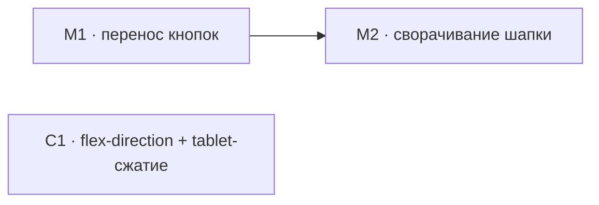

# Техспека — шапка модуля (кнопки+сворачивание) и форма «Властители города»

> Роль-автор: **Системный аналитик**. Адресат: **Разработчик**.
> Вход: [`2026-08-10-module-header-city-rulers-workplan.md`](2026-08-10-module-header-city-rulers-workplan.md)
> (роль «Аналитик»). Дата: 2026-08-10. Статус: **контракты готовы, разработка не начата.**

Нумерация (M1, M2, C1) — сквозная с планом Аналитика. Решения по открытым вопросам
плана (ОВ-1…ОВ-4) приняты в §4 этого документа.

---

## M1. Кнопки шапки модуля — перенос под бейджи, горизонтальный ряд

### M1.1 HTML — `web/public/index.html:290-343`

Переместить блок `.modp-header-btns` **внутрь** `.modp-header-main`, сразу после
`.modp-badges` и перед `.modp-header-edit`. Атрибуты/id кнопок не менять — JS-обработчики
(`modules.js:2577` `document.getElementById('modp-back-btn')`, аналогично для остальных
четырёх) резолвят по `id`, не по позиции в DOM, переезд ничего не ломает.

```html
<div class="modp-header">
  <div class="modp-header-main">
    <h1 class="modp-title" id="modp-title">Загрузка...</h1>
    <div class="modp-badges" id="modp-badges"></div>

    <div class="modp-header-btns">
      <button class="modp-back-btn" id="modp-back-btn">← Модули</button>
      <button class="modp-gen-btn" id="modp-gen-btn">🪄 Сгенерировать</button>
      <button class="modp-edit-btn" id="modp-header-edit-btn">✏ Редактировать</button>
      <button class="modp-close-btn" id="modp-close-btn">🔒 Закрыть модуль</button>
      <button class="modp-del-btn" id="modp-del-btn">🗑 Удалить модуль</button>
    </div>

    <div class="modp-header-edit" id="modp-header-edit" style="display:none">
      … (без изменений, строки 302-342 текущего файла)
    </div>
  </div>
</div>
```

`.modp-header` теперь оборачивает **один** прямой потомок (`.modp-header-main`) —
разметку самого `.modp-header` не трогать (см. M1.3, почему её CSS не нужно чистить
отдельным проходом).

### M1.2 CSS — `web/public/styles.css`

```css
/* styles.css:8657-8662, было flex-direction: column */
.modp-header-btns {
  display: flex;
  flex-direction: row;
  flex-wrap: wrap;      /* страховка на случай переполнения на очень узких экранах */
  gap: 8px;
  margin-top: 14px;      /* было margin-top:6px — отступ теперь от бейджей, не от края шапки */
}
```

Убрать ставший избыточным override на `styles.css:2759-2768`:

```css
/* УДАЛИТЬ целиком — .modp-header-btns теперь row+wrap на любой ширине по умолчанию */
.modp-header {
  flex-direction: column;
  gap: 14px;
}

.modp-header-btns {
  flex-direction: row;
  flex-wrap: wrap;
  margin-top: 0;
}
```

**Не трогать** `.modp-header { display:flex; align-items:flex-start; gap:20px; … }`
(`styles.css:8647-8655`) — правило безвредно с одним потомком, а прицельная уборка
`gap`/`align-items` здесь не даёт видимого эффекта и добавляет риск задеть что-то
непредвиденное ради нулевого выигрыша.

### M1.2b Дизайнерская правка — кнопка «Редактировать» в шапке выпадает из ряда 🎨

**Найдено на дизайн-проверке (роль «Дизайнер»), не было видно в вертикальной раскладке
— в горизонтальном ряду станет заметно сразу.** Кнопка «✏ Редактировать»
(`index.html:294`, `id="modp-header-edit-btn"`, класс `modp-edit-btn`) — единственная
из пяти кнопок шапки, не входящая в общий кластер «compact action button»
(`styles.css:2036-2071`, унифицирован проходом 2026-07-09, см.
`docs/design/2026-07-09-buttons-and-blocks-unification-plan.md`, кластер A). Остальные
четыре (`.modp-back-btn`, `.modp-gen-btn`, `.modp-close-btn`, `.modp-del-btn`) — общий
бокс-модель (Cinzel uppercase, `--fs-2xs`, `padding:6px 12px`, `--r-sm`).
`.modp-edit-btn` (`styles.css:11694-11707`) — свой шрифт (не Cinzel, не uppercase),
`font-size: var(--fs-lg)` (заметно крупнее соседей), `padding: 2px 10px`, цвет
`var(--crimson)`, и `margin-bottom: 6px` — рудимент вертикальной раскладки, который
в горизонтальном ряду M1 просто собьёт кнопку по вертикали относительно соседей.

**Важно — НЕ красить `.modp-edit-btn` глобально.** Проверил: класс `.modp-edit-btn`
переиспользуется ещё в **13 местах** по всей странице модуля — редактирование блоков
сценария, НПС, влияния фракций (`modules.js:1604-1823`, `archive.js:456`). Это
установившийся, намеренный стиль «кнопки редактирования тела модуля», не ошибка —
перекраска класса задела бы все 13 мест ради фикса одной кнопки в шапке. Правка должна
быть точечной, только на инстанс внутри шапки:

```css
/* styles.css — новое правило рядом с .modp-header-btns (styles.css:8657) */
.modp-header-btns .modp-edit-btn {
  font-family: var(--f-heading);
  font-size: var(--fs-2xs);
  letter-spacing: .1em;
  text-transform: uppercase;
  padding: 6px 12px;
  border-radius: var(--r-sm);
  margin-bottom: 0;
  background: none;
  border: 1px solid var(--border);
  color: var(--gold);
}

.modp-header-btns .modp-edit-btn:hover {
  border-color: var(--gold);
  background: rgba(184, 134, 11, 0.08);
}
```

Цвет — золото (Secondary/Ghost), не crimson: у «Редактировать» здесь нет причины быть
красной, это не primary и не опасное действие, а вход в форму правки — тот же смысл,
что у «🔒 Закрыть модуль». Скоупинг через `.modp-header-btns .modp-edit-btn` (потомок
только внутри нового ряда кнопок шапки) гарантирует, что все 13 других мест
использования `.modp-edit-btn` в теле модуля остаются как есть — правка их не касается.

**Итоговая цветовая иерархия ряда шапки** (после правки — не три оттенка красного на
пять кнопок, а два семейства с понятной ролью): ← Модули = золото-контур (навигация) ·
🪄 Сгенерировать = Blood Oath заливка (primary) · ✏ Редактировать = золото-контур
(secondary) · 🔒 Закрыть модуль = золото-заливка-тон (secondary/церемониальное) ·
🗑 Удалить модуль = красный контур (единственная danger-кнопка ряда — не теряется
среди других красных).

### M1.3 Приёмка

1. На 1280px и на 960/768px (после снятия override из M1.2) кнопки — горизонтальный
   ряд под бейджами на **любой** ширине, не только узкой.
2. Клики по всем пяти кнопкам работают как раньше (переход «← Модули», генерация,
   вход в режим правки, закрытие, удаление) — обработчики резолвятся по `id`,
   регрессии не ожидается, но прогнать вручную после переноса блока.
3. `.modp-header-edit` открывается под кнопками (клик «✏ Редактировать»), не наезжает
   и не расталкивает ряд кнопок неожиданно.

---

## M2. Сворачиваемая шапка модуля

### M2.1 Решения по открытым вопросам плана (ОВ-1, ОВ-2, ОВ-3)

| # | Решение |
|---|---|
| **ОВ-1** | В свёрнутом состоянии скрываются `.modp-badges`, `.modp-header-btns` и `.modp-header-edit` (если была открыта — заодно закрыть форму правки при сворачивании, см. M2.3). `.modp-title` остаётся — это единственный ориентир «какой модуль открыт». Полностью прятать шапку (заголовок в т.ч.) не нужно: цель пользователя — освободить место под сценарий, а не спрятать контекст. |
| **ОВ-2** | Один глобальный ключ `localStorage` (`sanguine-module-header-collapsed`), как у сайдбара — не per-модуль. Проще, консистентно с единственным существующим прецедентом; цена ошибки низкая (лишний клик развернуть для короткого модуля). |
| **ОВ-3** | Кнопки недоступны напрямую в свёрнутом состоянии — доступ через разворачивание (один клик). Достаточно, так как это не часто нажимаемые в моменте кнопки (генерация/правка/закрытие/удаление — не построчная работа со сценарием). |

### M2.2 HTML — кнопка-тумблер

Добавить в `.modp-header-main`, сразу перед `.modp-title` (по аналогии с положением
`#btn-sidebar-collapse` рядом с логотипом сайдбара):

```html
<button type="button" class="modp-header-collapse-btn tour-replay-btn" id="modp-header-collapse-btn"
        aria-expanded="true" title="Свернуть шапку модуля" aria-label="Свернуть шапку модуля">▴</button>
```

### M2.2b Дизайнерская правка — тумблер должен визуально быть ТЕМ ЖЕ компонентом, что у сайдбара 🎨

M2.2/M2.3 в исходном виде описывали кнопку-тумблер с собственными размерами/радиусом —
но раз пользователь просил «подобно сворачиванию раздела навигации», а не «в похожем
духе», это должен быть узнаваемо **тот же** визуальный компонент, не вариация. Реальный
класс сайдбара — `.tour-replay-btn`/`.sidebar-collapse-btn`
(`styles.css:12599-12646`): круг 26×26px, `border-radius: 50%` (не `var(--r-sm)` —
это единственное системное исключение из острых углов кнопок, уже установленное для
именно этого типа компактных утилитарных тумблеров), рамка `var(--border2)` (ярче
базовой `var(--border)`), hover добавляет золотую подложку `rgba(184,134,11,.1)`
поверх смены цвета рамки/текста, поворот на 180° управляется атрибутом
`[aria-expanded="false"]` на самой кнопке (не классом на родителе — и JS M2.4 уже
проставляет `aria-expanded`, значит переключатель бесплатный).

HTML выше уже переиспользует `.tour-replay-btn` как базовый класс (даёт бокс-модель),
`.modp-header-collapse-btn` — второй класс только для позиционирования в новом
контексте (не для переопределения бокс-модели самой кнопки).

### M2.3 CSS — `web/public/styles.css`, новый блок рядом с `.modp-header` (после §8647-8763)

Анимация — `max-height`/`opacity`, не `display:none` (правило проекта, `DESIGN.md`
→ Don't: «не анимировать display/layout-свойства напрямую»; тот же приём, что у
`#sidebar.collapsed`, `styles.css:2810-2877`):

```css
/* Бокс-модель/цвет/hover — уже даёт .tour-replay-btn (styles.css:12599-12633),
   переиспользуется как есть. НО: transition для transform объявлен только у
   .sidebar-collapse-btn (styles.css:12638-12642), не в общем блоке — при реюзе
   .tour-replay-btn его нужно продублировать здесь явно, иначе поворот будет
   рывком, а не плавной анимацией (проверено на самом сайдбаре — этот второй
   transition НЕ мёржится с первым, он его полностью заменяет по CSS-каскаду). */
.modp-header-collapse-btn {
  flex-shrink: 0;
  transition: transform var(--dur-base) var(--ease), color var(--dur-fast) var(--ease),
    border-color var(--dur-fast) var(--ease), background var(--dur-fast) var(--ease);
}

.modp-header-collapse-btn[aria-expanded="false"] {
  transform: rotate(180deg);
}

.modp-header.collapsed {
  padding-bottom: 10px;   /* было 20px — компактнее, раз бейджи/кнопки скрыты */
}

.modp-header.collapsed .modp-badges,
.modp-header.collapsed .modp-header-btns,
.modp-header.collapsed .modp-header-edit {
  max-height: 0;
  opacity: 0;
  overflow: hidden;
  margin: 0;
  pointer-events: none;
  transition: max-height var(--dur-base) var(--ease), opacity var(--dur-fast) var(--ease);
}
```

`.modp-title` уже не имеет `margin-bottom` override для свёрнутого состояния — при
скрытых бейджах/кнопках это создаст лишний нижний отступ под заголовком; добавить:

```css
.modp-header.collapsed .modp-title {
  margin-bottom: 0;
}
```

### M2.4 JS — `web/public/scripts/modules.js`, рядом с прочими обработчиками шапки (после `modp-back-btn` листенера, `~строка 2577`)

Копия паттерна сайдбара (`scripts.js:59-82`), другой ключ/элементы:

```js
(function () {
  const KEY = 'sanguine-module-header-collapsed';
  const btn = document.getElementById('modp-header-collapse-btn');
  const header = document.querySelector('.modp-header');
  if (!btn || !header) return;

  function apply(collapsed) {
    header.classList.toggle('collapsed', collapsed);
    btn.setAttribute('aria-expanded', String(!collapsed));
    const label = collapsed ? 'Развернуть шапку модуля' : 'Свернуть шапку модуля';
    btn.title = label;
    btn.setAttribute('aria-label', label);
    // Сворачивание закрывает открытую форму правки заголовка (ОВ-1) — иначе
    // она остаётся в DOM развёрнутой под max-height:0 и её вылезающие поля
    // (datalist/select) визуально ломают свёрнутую полосу.
    if (collapsed) {
      const editBlock = document.getElementById('modp-header-edit');
      const editBtn = document.getElementById('modp-header-edit-btn');
      if (editBlock && editBlock.style.display !== 'none') editBtn?.click();
    }
  }

  let collapsed = false;
  try { collapsed = localStorage.getItem(KEY) === '1'; } catch {}
  apply(collapsed);

  btn.addEventListener('click', () => {
    collapsed = !collapsed;
    apply(collapsed);
    try { localStorage.setItem(KEY, collapsed ? '1' : '0'); } catch {}
  });
})();
```

**Проверить перед тем, как полагаться на `editBtn?.click()`**: убедиться, что клик по
`#modp-header-edit-btn`, когда форма правки уже открыта, действительно её закрывает
(toggle), а не безусловно открывает — если открытие/закрытие управляется раздельными
флагами/классами, а не одним toggle-обработчиком, заменить на прямой вызов той функции,
что закрывает форму (найти в `modules.js` обработчик `modp-header-edit-btn`).

### M2.5 Приёмка

1. Клик по тумблеру сворачивает шапку (заголовок остаётся, бейджи/кнопки/форма правки
   уезжают через анимацию, не рывком).
2. Состояние переживает перезагрузку страницы (localStorage).
3. Открытая форма правки при сворачивании закрывается, а не прячется «зависшей».
4. `prefers-reduced-motion` уже покрыт глобальным правилом (`styles.css:1132` и
   аналоги) — отдельно ничего добавлять не нужно, транзишны используют общие токены
   `var(--dur-base)`/`var(--dur-fast)`.

---

## C1. «Властители города» / Примогенат / Ключевые локации — однострочные поля

### C1.1 CSS — базовый фикс направления (`web/public/styles.css`, рядом с `styles.css:3886-3888`)

```css
/* было: .cdet-pol-row, .cdet-prim-row, .cdet-loc-row { flex-wrap: wrap; } */
.cdet-pol-row, .cdet-prim-row, .cdet-loc-row {
  flex-direction: row;
  align-items: center;
  flex-wrap: wrap;
}
```

Это чинит ≥900px сразу (подтверждено измерением в плане Аналитика — на 900/960/1280px
ряд после этого фикса укладывается в одну строку без дополнительных правок).

### C1.2 CSS — сжатие полей на tablet-tier (ОВ-4: переиспользуем именованную схему
брейкпоинтов из `2026-08-10-responsive-adaptive-layout-techspec.md`, R5 — `tablet`
= ≤1023px, не заводим отдельное число)

Селекторы уже сгруппированы в текущем CSS одинаково для всех трёх редакторов
(`.cdet-pol-role-sel, .cdet-prim-clan-sel` на `styles.css:3890`;
`.cdet-pol-name-inp, .cdet-loc-name-inp, .cdet-prim-name-inp` на `styles.css:3911`) —
`.cdet-loc-type-sel` использует класс `.cdet-pol-role-sel` напрямую (см.
`city.js:249`), поэтому один блок ниже покрывает все три редактора без дублирования:

```css
@media (max-width: 1023px) {
  .cdet-pol-role-sel, .cdet-prim-clan-sel,
  .cdet-pol-role-custom, .cdet-loc-type-custom, .cdet-prim-clan-custom {
    flex-basis: 100px;
  }

  .cdet-pol-name-inp, .cdet-loc-name-inp, .cdet-prim-name-inp {
    flex-basis: 150px;
  }
}
```

**Расчёт бюджета** (худший случай — 3 поля + кнопка, «Властители»/«Примогенат»,
измерено на 768px viewport: доступная ширина ряда 497px): 100 (select) + 150×2
(имя/второе имя) + ~40 (кнопка ✕) + 3×8 (gap) = 464px ≤ 497px — запас 33px. Для
«Ключевых локаций» (select+имя+заметка+кнопка, без второго имени) бюджет ещё свободнее
(заметка `.cdet-loc-status-note-inp` не тронута, остаётся 140px — не входила в
измеренный худший случай, но с более просторным бюджетом при 3 основных полях вместо 4).

### C1.2b Дизайнерская проверка — 100px/150px не тесно 🎨

Проверил предложенные размеры на реальном содержимом полей, не только на арифметике
бюджета. `<select>` на 100px: подписи должностей — короткие русские слова («Князь»,
«Сенешаль», «Шериф», «Примоген») — умещаются без обрезки; для более длинных
(«Секретарь», «Хранитель Хроник» — если такие есть в `CITY_POLITICAL_ROLES`) браузер
сам укорачивает текст закрытого `<select>` многоточием — нативное поведение, не требует
доп. CSS. `<input>` на 150px при `var(--fs-sm)` — комфортно для большинства русских
имён (6-9 символов); длинные составные имена (Имя+Фамилия) при необходимости
скроллятся внутри поля курсором при фокусе — стандартное поведение текстового инпута,
не потеря данных и не визуальный баг (в отличие от `<select>`, у активного `<input>`
всегда есть способ долистать до конца текста). Возражений нет, оставляю 100px/150px
как есть.

### C1.3 Приёмка

1. **Властители города** (`.cdet-political-rows`): на 1280/960/900px — одна строка,
   поля в исходных размерах (150/200/200). На 820/768/700px — одна строка, поля сжаты
   (100/150/150), не переносятся на вторую строку.
2. **Примогенат** (`.cdet-primogen-rows`) — тот же тест, та же геометрия полей
   (идентичная разметка `_primRowHtml` vs `_polRowHtml`).
3. **Ключевые локации** (`.cdet-location-rows`) — та же проверка; состав полей другой
   (select+имя+заметка вместо select+имя+второе-имя), проверить визуально на 768px,
   что заметка `.cdet-loc-status-note-inp` не проваливается на вторую строку — расчёт
   в C1.2 предсказывает запас, но это единственный из трёх редакторов, не измеренный
   вживую Аналитиком, поэтому явный пункт приёмки, не предположение.
4. Во всех трёх — `<select class="cdet-loc-type-sel">` (без выбора «Другое…») и
   `.cdet-loc-type-custom` (текстовое поле, появляется при «Другое…») не показываются
   одновременно (`_locRowHtml`, `city.js:250`, `style="display:none"` по умолчанию) —
   сжатие ширины на них не должно провоцировать взаимное перекрытие в момент
   переключения на «Другое…» (переключение меняет `display`, не ширину — риска нет,
   но стоит один раз проверить глазами при приёмке).

---

## Порядок сдачи



M2 зависит от M1 (нечего сворачивать осмысленно, пока кнопки не легли в новую
структуру — `.modp-header-btns` как отдельный сворачиваемый блок существует только
после M1). C1 полностью независим, можно вести параллельно с M1/M2.

**Обязательное к соблюдению** (повтор из `CLAUDE.md` → «Веб-интерфейс», как и в
прежних техспеках): после правок фронтенда — `/code-review`, затем визуальная
проверка через `run-sanguine-web` на ширинах 1280/960/900/768/700px для M1/M2
(шапка модуля) и 1280/960/900/820/768/700px для C1 (три редактора).

Разработка не начата.
