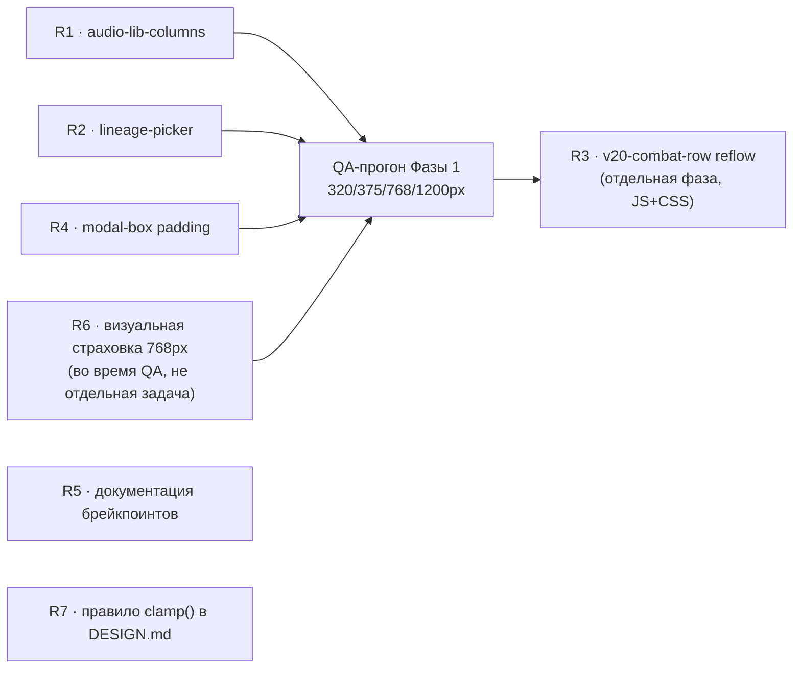

# Техспека адаптивной вёрстки — контракты для Разработчика

> Роль-автор: **Системный аналитик**. Адресат: **Разработчик**.
> Вход: [`2026-08-10-responsive-adaptive-layout-plan.md`](2026-08-10-responsive-adaptive-layout-plan.md)
> (роль «Дизайнер», impeccable/`adapt`).
> Дата: 2026-08-10. Статус: **контракты готовы, разработка не начата.**

Нумерация пунктов (R1, R2, …) — новая, план дизайнера ссылок на пункты не нумеровал
единообразно. Соответствие плану указано в каждом пункте.

---

## 0. Проверка фактов плана — два расхождения

Перед тем как писать контракты, перепроверил код по каждому пункту плана. Два места
разошлись с тем, что там написано — фиксирую отдельно, чтобы Разработчик не терял
время на то, что уже не актуально.

### 0.1 `.v20-combat-row` — деградация уже есть, это не P0

План (§2.1) утверждал «горизонтальный скролл … не адаптация», без адаптации вообще.
Неточно: `.v20-combat-row` (`styles.css:11279`) обёрнута в `.v20-combat`
(`styles.css:11273-11278`), у которой уже стоит `overflow-x: auto`. То есть на узком
экране таблица **не ломает страницу** — она скроллится вбок внутри своего блока,
остальной лист остаётся читаемым. Это рабочий, пусть не идеальный, фолбэк.

**Понижаю приоритет P0 → P1** (см. R3). Карточный reflow остаётся в плане как
UX-улучшение (читать боевые статы боком в бою неудобно), но не блокирует релиз.

### 0.2 «10 px-заголовков без адаптации» (план §3.3) — не заголовки, ложная тревога

Проверил все 10 строк из списка плана
(`1787/2150/3079/3246/5951/6362/6412/6952/11648/12938`). Все десять —
`font-size` **одиночных иконок-глифов** в декоративных/служебных элементах:

| Строка | Селектор | Контекст |
|---|---|---|
| 1787 | `.char-lineage-icon` | иконка линейки, `position: absolute` поверх карточки |
| 2150 | (close-кнопка модалки) | иконка ✕, `position: absolute` |
| 3079 | `.lineage-pick-btn .lp-icon` | иконка внутри кнопки выбора линейки |
| 3246 | `.cdet-no-portrait` | плейсхолдер-иконка в `flex; align-items:center; justify-content:center` блоке `width:100%;height:100%` |
| 5951 | `.loc-zone-icon` | декоративная иконка зоны, `position: absolute` |
| 6362 | (стрелка навигации по арту) | иконка ‹/›, фиксированная кнопка 44×70px |
| 6412 | `.locdet-no-img` | тот же паттерн, что 3246, для локаций |
| 6952 | `.diary-item-icon` | иконка строки дневника, `flex-shrink: 0` |
| 11648 | `.modp-empty-icon` | иконка пустого состояния |
| 12938 | `.modp-char-cards .char-lineage-icon` | переопределение 1787 для карточек модуля |

Ни один не является блоком текста, который может перенестись/переполнить
контейнер — это одиночный emoji-глиф либо в `flex`-центрированном боксе
(`.cdet-no-portrait`/`.locdet-no-img`, где родитель уже `width:100%;height:100%` —
глиф просто крупнее/мельче относительно контейнера, не вылезает за его границы),
либо `position: absolute` с фиксированным `top/right` (декоративный оверлей поверх
уже-адаптированной карточки). **Риска переполнения на узких экранах нет.**

**Убираю пункт из скоупа.** Кода не требует, аналогично прецеденту B3 в
`2026-08-04-city-section-techspec.md` («аудит — завершён, кода не потребовало»).

---

## 1. Приоритет 🔴 — реальный пробел, нет ни одного медиа-правила

### R1. `.audio-lib-columns` — 3 колонки без брейкпоинта (план §2.2)

**Контекст подтверждён:** `#page-audio-library.page` (`index.html:938`) — полноширинная
страница (не модалка с капом ширины), значит и tablet-диапазон (700–1023px) реально
сжимает 3 колонки, не только телефон. `grep` по `audio-lib-columns` — единственное
объявление на `styles.css:10612`, переопределений нет.

Соседний комментарий (`styles.css:10628-10631`) уже фиксирует, что
`.audio-lib-col-cards` (карточки *внутри* одной колонки) держат ровно 1 колонку,
потому что плеер с 4 иконками физически не помещается в узкую 2-up сетку при
44px тач-целях. Это ограничение не противоречит фиксу ниже — наоборот, обосновывает
его: если внешние 3 колонки не схлопнутся на узком экране, каждая внутренняя колонка
станет ещё уже, чем сейчас, и получит ровно ту проблему, которую комментарий уже
описывает для 2-up.

**Контракт** — добавить сразу после блока `.audio-lib-columns`
(`styles.css:10612-10617`):

```css
@media (max-width: 700px) {
  .audio-lib-columns { grid-template-columns: 1fr; }
}

@media (min-width: 701px) and (max-width: 1023px) {
  .audio-lib-columns { grid-template-columns: repeat(2, minmax(0, 1fr)); }
}
```

700px — граница, совпадающая с существующим брейкпоинтом сайдбара
(`styles.css:2759`), не новое число (см. R5). При 2 колонках третья
(«Пресеты») естественно переносится на новую строку — стандартное поведение
grid, отдельного правила не требует.

**Приёмка:** на 375px — 1 колонка (Музыка/Эффекты/Пресеты друг под другом);
на 820px — 2 колонки (третья строкой ниже); на 1200px — 3 колонки, как сейчас.
Внутренние карточки (`.audio-lib-col-cards`) не трогать — уже 1-up на любой ширине.

---

### R2. `.lineage-picker` — 3 колонки без брейкпоинта (план §2.3)

**Контекст подтверждён:** живёт внутри `.modal-box` (базовая модалка создания
персонажа), которая капается `width: min(560px, 95vw)` — то есть на ЛЮБОЙ ширине
экрана ≥ ~590px модалка не превышает 560px, и 3 колонки при 560px (минус паддинг
44px×2) уже дают комфортные ~140px на кнопку. **Tablet-диапазон фикса не требует** —
единственная реальная проблема — на экранах уже ~590px, где `95vw` начинает жать
саму модалку.

`LINEAGES` (`scripts.js:420-427`) — ровно 6 пунктов (Вампиры/Феи/Смертные/
Оборотни/Маги/Охотники), значит 2 колонки дают чистые 3 строки без «сироты».

**Контракт** — добавить сразу после блока `.lineage-picker`
(`styles.css:3046-3050`):

```css
@media (max-width: 700px) {
  .lineage-picker { grid-template-columns: repeat(2, 1fr); }
}
```

**Приёмка:** на 375px — 2×3 сетка (6 кнопок, 3 полных ряда), кнопки не сжаты по
вертикали ниже комфортного тач-таргета.

---

## 2. Приоритет 🟡 — деградирует, но не ломает функциональность

### R3. `.v20-combat-row` — карточный reflow вместо горизонтального скролла (план §2.1, понижен см. §0.1)

**Не блокирует релиз** (см. §0.1 — фолбэк уже есть). Делать вторым проходом,
отдельно от R1/R2/R4, так как требует правки и CSS, и разметки (не только CSS):

- `web/public/scripts/v20-sheet.js` — рендер `.v20-combat-row` (боевая таблица:
  оружие/урон/сложность/…, 7 колонок) добавить `data-label` на каждую ячейку
  (значение — заголовок колонки из `.v20-combat-head`), по паттерну
  `reference/adapt.md` → Layout Adaptation Patterns → Tables.
- `styles.css` — добавить в блок `@media (max-width: 700px)` рядом с R1/R2:

```css
@media (max-width: 700px) {
  .v20-combat-row {
    grid-template-columns: 1fr;
    min-width: 0;
  }
  .v20-combat-row > * {
    display: flex;
    justify-content: space-between;
  }
  .v20-combat-row > *::before {
    content: attr(data-label);
    font-family: var(--f-head);
    font-size: var(--fs-2xs);
    letter-spacing: .06em;
    text-transform: uppercase;
    color: var(--text3);
  }
  .v20-combat-head { display: none; } /* подписи теперь на каждой ячейке */
}
```

**Приёмка:** на 375px боевая таблица читается без горизонтального скролла, каждое
поле подписано; на ≥701px — без изменений (7-колоночная сетка, как сейчас).

**Не делать без R1/R2 в проде** — если Фаза 1 (R1/R2/R4) не отгружена, R3
можно смело отложить: он не является пререквизитом ни для чего.

---

### R4. Паддинг `.modal-box` на очень узких телефонах (план §2.4)

**Уточнение скоупа:** касается **только базовой** `.modal-box`
(`styles.css:2993-3000`, `padding: 40px 44px`). Три именованных детальных
модалки — `.modal-detail` (`3188`), `.modal-loc-detail` (`6134`),
`.modal-module-detail` (`7666`) — уже переопределяют `padding: 0` и правят
внутренние регионы сами; их этот пункт не касается.

На 320–375px (`iPhone SE` и похожие) `.modal-box` получает `width: min(560px, 95vw)`
≈ 304–356px; минус `44px × 2` паддинга — на контент остаётся ~216–268px. Форма
ещё функциональна (не ломается), но заметно теснее, чем должна быть.

**Контракт** — новый брейкпоинт 480px (обоснование числа — см. R5, это не
структурный layout-брейкпоинт компонента страницы, а локальный «дыхательный»
отступ для самой узкой модалки; переиспользовать 700 здесь избыточно, модалка
и на 700px ещё не тесная):

```css
@media (max-width: 480px) {
  .modal-box { padding: 24px 20px; }
}
```

**Приёмка:** на 320/375px форма создания персонажа (типичный `.modal-box`)
открывается без горизонтального скролла содержимого, поля не прижаты к краю
модалки впритык.

---

## 3. Приоритет — не требует кода, только проверка

### R6. `.v20-header`/`.v20-grid3` на планшетном портрете 768px (план §3.2)

План просил визуальную проверку. Посчитал геометрию без браузера, чтобы не
блокировать техспеку живым тестом:

- На 768px viewport `.modal-detail` = `min(1600px, 96vw)` = `96vw` ≈ 737px.
- 768px < 820px (порог `styles.css:13179`) → `#char-detail-content` уже в
  `flex-direction: column`, портрет уходит наверх высотой 200px — `.cdet-info-col`
  получает почти всю ширину модалки, не половину.
- `.v20-grid3`/`.v20-header`: `repeat(3, 1fr)`, `gap: 8-18px` → при ширине контента
  ≈ 660-670px (737px минус паддинг вкладки) каждая колонка ≈ 200-210px. Для пары
  «короткий лейбл (`.v20-field-lbl`, `--fs-2xs`) + подчёркнутый инпут» этого достаточно.

**Вывод: отдельный tablet-tier для `.v20-grid3`/`.v20-header` не нужен**, расчёт
показывает комфортный запас. Это расчёт по CSS-геометрии, не скриншот — при
QA-прогоне Фазы 1 (R1/R2/R4, см. §4) добавить один быстрый визуальный чек на
768px как страховку; если колонки реально окажутся тесными — фикс: та же
media-конструкция, что в R1 (`min-width:701px / max-width:1023px`,
`grid-template-columns: repeat(2, 1fr)`), без дополнительного анализа.

---

## 4. Документационные пункты (без изменения поведения)

### R5. Именованная схема брейкпоинтов (план §3.1)

Добавить комментарий-шапку над первым `@media`-блоком в `styles.css` (не
переносить существующие 699/720/820/900/960/1099 — они calibrated по контенту,
трогать без причины — лишний риск регрессии):

```css
/* ── Брейкпоинты: три именованных tier'а ──────────────────────────────────
   phone   (≤ 700px)      — сайдбар в icon-rail (см. 2759), grid → 1 колонка,
                            таблицы/плотные сетки → карточки.
   tablet  (701–1023px)   — 2-колоночные гибриды; существующие точки 720/820/
                            900/960 живут внутри этой полосы под конкретный
                            компонент, а не как отдельная схема.
   desktop (≥ 1024px)     — полные сетки, сайдбар развёрнут.
   Новый компонент сверяется с 700/1023 как базовой парой; отклонение —
   только если контент реально ломается в другой точке (тоже content-driven,
   просто задокументированное через комментарий у самого правила). ── */
```

Разместить над блоком `── Responsive ──` (`styles.css:2723`).

### R7. Правило по `clamp()` (план §4)

Добавить в `DESIGN.md`, раздел «Layout» (после существующей фразы про
`repeat(auto-fit, minmax(280px, 1fr))`):

> `clamp()` — только для изолированных display/hero-чисел вне сетки (пример:
> `styles.css:3516`). Для всего, что живёт внутри grid/card-компонента —
> брейкпоинт из именованной схемы (`phone`/`tablet`/`desktop`, `styles.css`
> шапка Responsive-секции), не fluid-типографика. Причина — продуктовый
> регистр (`reference/product.md`): «Responsive behavior is structural … not
> fluid typography».

---

## 5. Порядок сдачи



R1, R2, R4 — независимые CSS-only правки, безопасно мёржить одним PR или по
отдельности. R5/R7 — документация, без зависимостей, можно сделать в любой
момент (рекомендую вместе с R1/R2/R4, чтобы шапка Responsive-секции появилась
до, а не после первых новых брейкпоинтов). R3 — отдельная фаза после QA
Фазы 1, требует правки `v20-sheet.js` (не только CSS). R6 не задача, а пункт
QA-чеклиста.

**Обязательное к соблюдению** (повтор из `CLAUDE.md` → «Веб-интерфейс», как и в
прежних техспеках этого проекта): после правок фронтенда — `/code-review`, затем
визуальная проверка через скилл `run-sanguine-web` на ширинах из плана-дизайнера
(320/375/768/1024px) перед мёржем.

Разработка не начата.
