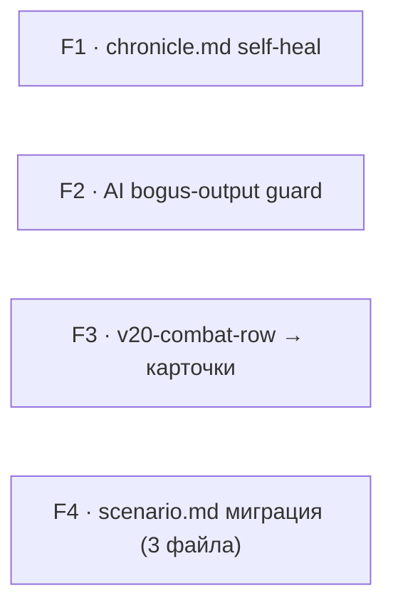

# Техспека — 4 находки из код-ревью/UX-аудита 2026-08-11

> Роль-автор: **Системный аналитик**. Адресат: **Разработчик**.
> Вход: анализ роли «Аналитик» этой же сессии («Изучи проект, найди слабые места
> в логике и UX») — отчёт передан в чате, отдельного `-workplan.md`-файла нет.
> Дата: 2026-08-11. Статус: **F1-F3 — контракты готовы; F4 — контракт готов после
> выбора «вариант А» (автомиграция) и разбора реальных файлов, разработка не
> начата ни по одному пункту.**

Нумерация (F1–F4) — по серьёзности находок из отчёта Аналитика. F4 (рассинхрон
формата `scenario.md` старых/новых модулей) изначально был вынесен как открытый
продуктовый вопрос — пользователь выбрал **вариант А** (автомиграция), контракт
дописан в §4 ниже, **после** ручного разбора всех 6 реально затронутых файлов
(разбор поменял оценку объёма — см. §4.1). F1-F4 независимы, вести можно в любом
порядке/параллельно.

---

## F1. «Описание» хроники — 404 вместо создания `chronicle.md` при его отсутствии

### F1.1 Диагноз

`chronicle.md` в проекте намеренно опционален (`web/routes/chronicles.js:450`,
комментарий «старые хроники хранят только events.md + модули») — но
`GET`/`PUT /api/chronicles/:slug/fields` (`web/routes/chronicles.js:254-278`)
на отсутствие файла (`raw === null`) отвечают `404`, будто хроники не существует.
На реальных данных Парижа минимум 2 из 5 хроник (`zimniy_parizh_2010`,
`parizh_2010_nachalo_goda`) — активные, с модулями, просто без `chronicle.md`.

Секционный апсерт **внутри** уже существующего `chronicle.md`
(`_upsertChronicleSection`, `chronicles.js:65-75`) сам по себе корректен и уже
защищён от этого же класса бага (см. комментарий на `chronicles.js:60-64`) —
проблема ровно на уровень выше: файла-то целиком нет, до апсерта дело не доходит.

Фронтенд усугубляет: `openChrDetail()` (`web/public/scripts/modules.js:118-126`)
делает `fetch(...).then(r => r.json())` **без проверки `r.ok`** — `{error:...}`
от 404 молча кладётся в `fields`, рендерится как пустая форма «—»/«—»,
неотличимая от «настроение просто не задано». Ошибка всплывает только при
попытке сохранить (`_chrDescSave()`, `modules.js:189-214`, там `r.ok`
уже проверяется) — токастом «Хроника не найдена» для явно открытой хроники.

### F1.2 Контракт — backend, `web/routes/chronicles.js`

**Precondition для обоих роутов:** папка хроники (`chroniclesDir(city)/<slug>/`)
существует — это и есть настоящее условие «хроника найдена», не наличие
`chronicle.md`.

```js
// GET /api/chronicles/:slug/fields — было: raw===null → 404 всегда.
// Стало: 404 только если папки хроники нет вообще; если папка есть,
// а chronicle.md нет — отдать нулевые значения, ничего не создавая на диске
// (GET не должен иметь побочных эффектов записи).
router.get('/api/chronicles/:slug/fields', async (req, res) => {
  try {
    const city = reqCity(req);
    const slug = req.params.slug;
    const chrDir = path.join(chroniclesDir(city), slug);
    if (!await fs.stat(chrDir).catch(() => null))
      return res.status(404).json({ error: 'Хроника не найдена' });

    const mdPath = path.join(chrDir, 'chronicle.md');
    const raw = await fs.readFile(mdPath, 'utf-8').catch(() => null);
    res.json(raw === null ? { mood: '', description: '' } : parseChronicleFields(raw));
  } catch (e) { serverError(res, e); }
});
```

```js
// PUT /api/chronicles/:slug/fields — было: raw===null → 404, ничего не пишется.
// Стало: 404 только если папки хроники нет; если chronicle.md нет — создать его
// через renderChronicleMd() (тот же билдер, что и POST /api/chronicles, «пустая»
// хроника без списка модулей — их подтянет ближайший syncChronicleModuleLinks),
// затем применить mood/description как обычно.
router.put('/api/chronicles/:slug/fields', express.json(), async (req, res) => {
  try {
    const city = reqCity(req);
    const slug = req.params.slug;
    const { mood, description } = req.body || {};
    const chrDir = path.join(chroniclesDir(city), slug);
    if (!await fs.stat(chrDir).catch(() => null))
      return res.status(404).json({ error: 'Хроника не найдена' });

    const mdPath = path.join(chrDir, 'chronicle.md');
    const raw = await fs.readFile(mdPath, 'utf-8').catch(() => null);
    const base = raw === null ? renderChronicleMd(slug, slug, city, '', []) : raw;

    const card = writeChronicleFields(base, { mood, description });
    await writeFileAtomic(mdPath, card, 'utf-8');
    res.json(parseChronicleFields(card));
  } catch (e) { serverError(res, e); }
});
```

**Про `display` в `renderChronicleMd(slug, slug, city, '', [])`:** билдер ожидает
человекочитаемое название первым аргументом (обычно из формы создания хроники);
здесь его негде взять (старые хроники без `chronicle.md` хранят название только
в `events.md` H1, отдельным парсингом). **Решение:** переиспользовать уже
существующий на этом же роуте паттерн чтения названия из `events.md`
(`web/routes/chronicles.js:164-168`, тот же, что использует `GET /api/chronicles`
для списка) — прочитать `display` тем же способом перед вызовом `renderChronicleMd`,
не хардкодить slug как название.

### F1.3 Контракт — frontend, `web/public/scripts/modules.js`

`openChrDetail()`, ветка `_chrDetailTab === 'description'` (строки 118-126) —
добавить проверку `r.ok`, по образцу уже существующей в `_chrDescSave()`:

```js
} else if (_chrDetailTab === 'description') {
  try {
    const r = await fetch(`/api/chronicles/${encodeURIComponent(slug)}/fields${qs}`);
    if (!r.ok) throw new Error('not ok');
    const fields = await r.json();
    STATE._chrFields = STATE._chrFields || {};
    STATE._chrFields[slug] = fields;
    body.innerHTML = _chrDescPanelHtml(fields);
  } catch {
    body.innerHTML = '<div class="loading-state" style="color:var(--accent3)">⚠ Не удалось загрузить</div>';
  }
}
```

После F1.2 это ветвление на практике для существующих хроник больше не сработает
(404 остаётся только для реально несуществующей хроники) — но чинить надо всё
равно: тот же паттерн «не проверять `r.ok`» может повториться в другом месте,
и сам по себе молчаливый проглот ошибки — дефект независимо от того, как часто
он сейчас триггерится.

### F1.4 Приёмка

1. Открыть вкладку «📝 Описание» на `zimniy_parizh_2010` или
   `parizh_2010_nachalo_goda` (обе реально без `chronicle.md` на диске сейчас) —
   форма показывает пустые поля без ошибки, ввод и «Сохранить» работают, после
   сохранения `chronicle.md` появляется на диске с корректным `display`-именем
   (сверить с тем, что показывает список хроник) и записанными полями.
2. Повторное открытие той же вкладки после сохранения — поля подгружаются
   корректно (не 404, не пусто).
3. Хроника, которой не существует вообще (несуществующий slug в URL) —
   по-прежнему честный 404 на обоих роутах.
4. Регрессия: хроники, у которых `chronicle.md` уже есть — поведение не
   изменилось (сравнить до/после на `stanovlenie_anarhov`, где файл есть).

---

## F2. Генерация сценария/финала не отличает отказ модерации/утечку рассуждений от настоящего текста

### F2.1 Диагноз

Подтверждено вживую в этой сессии на реальном модуле «Передел рынка»
(криминальный сюжет): Claude OAuth один раз вернул буквальный отказ
(`User Safety: unsafe / Safety Categories: Criminal Planning/Confessions, Violence`),
другой раз — «утечку рассуждений»/повторы вместо прозы. Оба раза
`web/routes/modules/lifecycle.js` (закрытие модуля) принял результат как успех
(`ok: true`) и записал его в `finale.md`/`events.md` поверх настоящих данных
пользователя, дополнительно проставив модулю статус «закрыт», хотя закрытие по
факту не состоялось.

`web/routes/modules/fill.js:169` (`if (!scenarioText) return res.status(500)...`)
и `lifecycle.js` `runGen()` (`241-249`, оборачивает `genTextWithRetry` в
`finale`/`event`-генерацию) проверяют **только пустоту** ответа — непустой, но
бессмысленный (отказ/утечка) текст проходит как валидный.

Прецедент уже есть в кодовой базе: `_isBogusAppearance()`
(`web/routes/generation.js:188-189`) — детектор именно этого класса артефактов
для генерации внешности персонажа по фото. Не переиспользован в `fill.js`/
`lifecycle.js`, где инцидент реально произошёл.

### F2.1b Почему не через `genTextWithRetry`'s `isValid`

`genTextWithRetry` (`web/server.js:645`) уже умеет `isValid(text)` — колбэк,
переиспользованный в `generation.js:381-387/389` (промт-генерация), который на
`false` перебирает fallback-модели вместо того, чтобы падать. Проверил: эта
логика реализована **только** в OpenAI-совместимой ветке (`_isOA(gen)`,
`server.js:651-670`) — ветка Anthropic (`server.js:671-698`, используется
именно для Claude API-key/Claude OAuth, `gen.client.messages.create`) параметр
`isValid` **не читает вообще**, ретраит только на HTTP 429/529. Ровно тот путь
(«claude-login»), на котором произошёл реальный инцидент, `isValid` бы не
покрыл — поэтому F2.3/F2.4 ниже проверяют результат **после**
`genTextWithRetry`, а не полагаются на встроенный механизм. Расширение
Anthropic-ветки под `isValid` (чтобы бессмысленный ответ Claude тоже уходил в
retry/fallback-провайдер вместо немедленного отказа) — самостоятельное
улучшение, отдельное от этой техспеки; не блокирует F2.3/F2.4.

### F2.2 Контракт — общий хелпер

Вынести обобщённую версию `_isBogusAppearance` в `web/routes/modules/shared.js`
(уже сюда сходятся оба места, `fill.js` и `lifecycle.js` его импортируют) —
с настраиваемым порогом длины, т.к. ожидаемая длина разного контента разная
(портрет ~100-300 символов, финал ~1500-2500, сценарий ~5000):

```js
// web/routes/modules/shared.js — рядом с другими module-generation хелперами.
// Тот же класс проблемы, что _isBogusAppearance (web/routes/generation.js:188) —
// непустой, но бессмысленный ответ модели (модерационный отказ/утечка
// рассуждений) не должен приниматься как валидный сгенерированный контент.
// Обобщено на весь модуль-пайплайн после инцидента 2026-08 (docs/audit — findings F2).
const _BOGUS_GEN_RE = /^(user safety|content policy|i cannot|i can'?t assist|as an ai|i'm not able to|i won'?t)\b/i;
function isBogusGeneration(text, minLength = 200) {
  return !text || text.trim().length < minLength || _BOGUS_GEN_RE.test(text.trim());
}
module.exports = { /* …существующий экспорт…, */ isBogusGeneration };
```

**Почему не переиспользовать `_isBogusAppearance` напрямую, а копировать
паттерн:** она приватная (не экспортируется) в `generation.js` и порог длины
(25 символов) откалиброван под короткий портрет — вынести в `shared.js` с
параметром `minLength` и **оставить** `generation.js`'s `_isBogusAppearance` как
обёртку над новым хелпером с дефолтом 25, не дублировать регэксп в третьем месте:

```js
// web/routes/generation.js:188-189 — заменить локальное определение на:
const { isBogusGeneration } = require('./modules/shared');
const _isBogusAppearance = text => isBogusGeneration(text, 25);
```

### F2.3 Контракт — `web/routes/modules/fill.js` (генерация сценария)

```js
// было (fill.js:159-169):
let scenarioText;
try {
  scenarioText = (await genTextWithRetry(gen, { ...})).text.trim();
} catch (scenErr) { _logAiFail(...); throw scenErr; }
if (!scenarioText) return res.status(500).json({ ok: false, error: 'AI вернул пустой ответ.' });

// стало — добавить проверку сразу после успешного вызова, до записи файла:
if (isBogusGeneration(scenarioText, 800)) {
  _logAiFail(`fill/${chr}/${mod}: сценарий`, new Error('bogus/refusal output: ' + scenarioText.slice(0, 200)), gen);
  return res.status(502).json({ ok: false,
    error: 'AI вернул нерабочий ответ (похоже на отказ модерации или сбой генерации) — файл не изменён. Попробуй другого AI-провайдера в Инструменты → Модели AI, либо переформулируй описание модуля.' });
}
```

Порог `800` для сценария — ниже реального ожидаемого объёма (после F2 из задачи
«упрости шаблон» типовой сценарий ~4000-6000 символов), но заведомо выше любого
правдоподобного отказа/обрывка; калибровать по факту на реальных прогонах, если
окажется, что короткие валидные сценарии (2-3 сцены) попадают под порог.

**HTTP-код 502, не 500:** это не внутренняя ошибка сервера — это дефект
downstream-ответа AI-провайдера, семантически ближе к Bad Gateway. Проверить,
не завязан ли фронтенд на `500` конкретно для этого места (`grep` по
`fill-module`/`modp-gen-btn` в `modules.js`) — если завязан, использовать тот же
код, что и остальные ошибки генерации на этом экране, ради единообразия UX
важнее точности HTTP-семантики.

### F2.4 Контракт — `web/routes/modules/lifecycle.js` (закрытие модуля: finale + event)

Один общий `runGen()` (строки 241-249) — правится один раз, покрывает оба
вызова (`finaleText`, `eventBlock`):

```js
// было:
const runGen = async (system, user, maxTokens) => {
  try {
    const out = await genTextWithRetry(gen, { system, user, maxTokens, model: _claudeOnlyModel(gen, 'claude-opus-5') });
    return out.text.trim();
  } catch (e) { _logAiFail(`close/${chr}/${mod}`, e, gen); throw e; }
};

// стало:
const runGen = async (system, user, maxTokens, minLength = 200) => {
  try {
    const out = await genTextWithRetry(gen, { system, user, maxTokens, model: _claudeOnlyModel(gen, 'claude-opus-5') });
    const text = out.text.trim();
    if (isBogusGeneration(text, minLength)) {
      throw new Error('bogus/refusal output: ' + text.slice(0, 200));
    }
    return text;
  } catch (e) { _logAiFail(`close/${chr}/${mod}`, e, gen); throw e; }
};
```

**Важно — сохранить текущий контракт вызывающего кода.** Оба вызова
(`finaleText`/`eventBlock`, `lifecycle.js:253-264` и далее) уже оборачивают
`runGen(...)` в `.catch(() => '')` и проверяют `if (finaleText) {...}` перед
записью — значит бросок исключения из `runGen` при обнаружении бессмыслицы
**уже** приводит к тому же безопасному пути, что и сегодняшний реальный сбой
сети: пустая строка → секция не пишется, `finale`/`event` остаются `false` в
итоговом JSON-ответе закрытия. Никакой дополнительной правки в местах вызова
не требуется — проверить только итоговый ответ `POST .../close`: он уже
корректно сообщает `finale: false`/`event: false`, если генерация не удалась
(проверить на существующих тестах модуля `close`, не полагаться на память).

Указать `minLength` при вызове под конкретный тип контента: финал/событие —
оставить дефолт `200` (короче сценария, но заведомо длиннее отказа).

### F2.5 Приёмка

1. Юнит на `isBogusGeneration()`: пустая строка, строка короче порога, реальный
   пойманный в этой сессии текст отказа (`User Safety: unsafe...`) — все три
   `true`; реалистичный образец нормального сценария/финала — `false`.
2. `POST /fill` со стаб-провайдером, возвращающим короткий/отказной текст —
   ответ `502`, `scenario.md` **не** создаётся/не перезаписывается (если уже был).
3. `POST /close` со стаб-провайдером, возвращающим отказной текст для
   finale-генерации — `finale: false` в ответе, `finale.md` не создаётся;
   модуль не помечается закрытым по этой одной причине (свериться с остальной
   логикой `close`, что статус зависит от чего-то ещё — не расширять эту
   техспеку на весь `close`-флоу, только на генерацию).
4. Не сломать нормальный путь: реальная генерация на нейтральном (не
   криминальном/не насильственном) контенте по-прежнему проходит как раньше —
   прогнать хотя бы один живой `/fill` на новом тестовом модуле.

---

## F3. `.v20-combat-row` — горизонтальный скролл боевой таблицы V20-листа на телефоне

### F3.1 Диагноз

`web/public/styles.css:11415-11421` — `.v20-combat-row` (7 колонок,
`grid-template-columns: 2fr 1fr 1fr 1fr 1fr 1fr 1fr`, `min-width: 540px`) без
адаптации под узкий экран; родитель `.v20-combat` уже даёт `overflow-x: auto`
(`styles.css:11409-11413`) — то есть сегодняшнее поведение на телефоне это
горизонтальный скролл боевой таблицы, которую собственный аудит команды
(`docs/design/2026-08-10-responsive-adaptive-layout-plan.md`, §2.1) называет
самым приоритетным P0 и явно просит заменить на паттерн «таблица → карточки»
(`reference/adapt.md`), а не оставить скролл-костыль.

Разметка — `web/public/scripts/v20-sheet.js:2213-2216`:
- `combatHead` — один `<div class="v20-combat-row v20-combat-head">` с 7
  `<span>`-подписями («Оружие/атака», «Сложн.», «Урон», «Дальн.», «Скор.»,
  «Магазин», «Размер»).
- `combatRows` — по одному `<div class="v20-combat-row">` на запись оружия, 7
  `<input class="v20-line-input" data-tpath="combat.{i}.{key}">` внутри, **без**
  собственных подписей — подпись поля сегодня существует только в head-строке.

**Почему это не чисто CSS-фикс.** `<input>` не рендерит `::before`/`::after`
(replaced-элемент — генерируемый контент на нём не показывается ни в одном
браузере) — паттерн «карточка с подписанными полями» требует подписи на
обёртке вокруг `<input>`, не на самом инпуте. Значит нужна правка разметки в
`v20-sheet.js`, не только медиа-запрос в `styles.css`.

### F3.2 Контракт — HTML/JS, `web/public/scripts/v20-sheet.js:2213-2216`

```js
const V20_COMBAT_COLS = ['weapon', 'diff', 'damage', 'range', 'rate', 'clip', 'size'];
const V20_COMBAT_LABELS = ['Оружие/атака', 'Сложн.', 'Урон', 'Дальн.', 'Скор.', 'Магазин', 'Размер'];
const combatHead = `<div class="v20-combat-row v20-combat-head">${V20_COMBAT_LABELS.map(l => `<span>${l}</span>`).join('')}</div>`;
const combatRows = m.combat.map((c, i) =>
  `<div class="v20-combat-row">${V20_COMBAT_COLS.map((k, ci) =>
    `<label class="v20-combat-cell" data-label="${V20_COMBAT_LABELS[ci]}">
      <input class="v20-line-input" data-tpath="combat.${i}.${k}" value="${escAttr(c[k])}">
    </label>`).join('')}</div>`).join('');
```

`V20_COMBAT_LABELS` — вынесен из инлайна `combatHead` в отдельный массив,
чтобы не дублировать 7 русских подписей в двух местах (head и теперь ещё
per-cell `data-label`) — единственный источник истины для подписей.

### F3.3 Контракт — CSS, `web/public/styles.css` (рядом с `.v20-combat-row`, `:11415`)

Именованная схема брейкпоинтов проекта (`responsive-adaptive-layout-techspec.md`,
R5): `phone` = ≤700px — используется здесь, не отдельное число.

```css
@media (max-width: 700px) {
  .v20-combat-head { display: none; }  /* подписи теперь на каждом поле — head избыточен */

  .v20-combat-row {
    display: flex;
    flex-direction: column;
    gap: 6px;
    min-width: 0;               /* снимает 540px-минимум — причина скролла */
    padding: 10px;
    border: 1px solid var(--border);
    border-radius: var(--r-sm);
    margin-bottom: 8px;
  }

  .v20-combat-cell {
    display: grid;
    grid-template-columns: 90px 1fr;   /* подпись слева, поле справа — не полный стек в высоту */
    align-items: center;
    gap: 8px;
  }

  .v20-combat-cell::before {
    content: attr(data-label);
    font-size: var(--fs-2xs);
    color: var(--text3);
    text-transform: uppercase;
    letter-spacing: .04em;
  }

  .v20-combat-cell .v20-line-input { width: 100%; }
}
```

`.v20-combat` (родитель, `overflow-x: auto`, `styles.css:11409-11413`) не
трогать — на ≥701px поведение (родная горизонтальная таблица) остаётся как
есть, `overflow-x` просто перестаёт быть нужен ниже 700px, т.к. `min-width`
снят и скроллить нечего.

### F3.4 Приёмка

1. ≤700px: карточки вместо таблицы, у каждого поля — подпись слева (не head
   сверху), `input`ы редактируемы как раньше (`data-tpath` не менялся —
   существующий JS-обработчик сохранения листа резолвит по `data-tpath`, не по
   структуре разметки вокруг).
2. 701-1023px и ≥1024px: визуально не изменилось — таблица с head-строкой,
   `overflow-x: auto` при переполнении (как сейчас).
3. Добавление новой строки оружия (кнопка «+ добавить», если есть в UI) на
   ≤700px — новая карточка сразу в правильном (не табличном) виде, без
   пересборки страницы вручную.
4. Реальный телефон (не только DevTools-эмуляция) — минимум одна проверка
   перед приёмкой, по правилу `reference/adapt.md`, уже применённому в
   `responsive-adaptive-layout-plan.md` §6.

---

## F4. Миграция старого формата `scenario.md` (GM-справка/Тактика/ветвление/закрывающие секции) → новый 3-блочный

**Решение пользователя: вариант А** (автомиграция), с уточнениями по двум
файлам, не подходящим под общий алгоритм (§4.1, §4.4) — оба **исключены** из
автомиграции по явному ответу пользователя, оставлены как есть.

### F4.1 Реальный объём — пересчитан вручную, отличается от предположения из отчёта Аналитика

Отчёт Аналитика оценивал проблему абстрактно («старые модули хранят старый
формат»). Ручной разбор всех модулей по всем городам (`grep -rl` по маркерам
старого формата) даёт **6 файлов**, не абстрактное «несколько»:

| Файл | Реальная структура | Решение |
|---|---|---|
| `cities/paris/.../zimniy_parizh_2010/.../tsirk_tsirk_tsirk/scenario.md` | Чистый старый 6-блочный (GM-справка, Пролог/Сцена×5/Финал, per-scene «Тактика X», «### Бросок» с Успех/Провал, закрывающие «Открытые вопросы»+«колорит-сводка») | **Мигрировать** (F4.2-F4.5) |
| `cities/balmont/.../razborki_na_reke/scenario.md` | Тот же паттерн, 3 сцены | **Мигрировать** |
| `cities/balmont/.../vstrecha_v_parke/scenario.md` | Тот же паттерн, несколько «Тактика»/«Бросок» на сцену (несколько NPC в одной сцене) — без закрывающих секций (нет «Открытые вопросы»/колорит-сводки в этом файле) | **Мигрировать** (закрывающий шаг F4.4 просто не находит, что переносить — не ошибка) |
| `cities/paris/.../stanovlenie_anarhov/.../peredel_rynka/scenario.md` | Уже 3-блочный (Пролог/Сцена×3/Финал), без GM-справки/Тактики/Успех-Провал/закрывающих секций — попал в `grep -rl` только по совпадению `### Бросок` (сам паттерн валиден и в новом формате) | **Не требует миграции** — проверено вручную (`grep "Успех\|Провал"` — 0 совпадений), файл уже соответствует целевому формату |
| `cities/balmont/.../progulki_po_metro/scenario.md` | **Повреждён**, не просто «старый формат»: в начале файла — буквально утёкшие рассуждения AI («Давайте создадим сценарий для модуля... Сначала проверю таймлайн»), GM-справка стоит под `# ` (H1, дублирует заголовок модуля), а не `## ` — не попадает под `parseScenarioSections` вообще (парсер режет по `^##\s+`, весь этот блок — часть preamble) | **Исключить из автомиграции** (ответ пользователя) — оставить как есть |
| `cities/paris/.../sluchaynye_gosti/.../dengi_ne_problema/scenario.md` | Нестандартная сложная структура: топ-уровневые «Путь А»/«Путь Б» как альтернативные ветки прохождения, отдельный «Опционально» NPC-блок, свои формулировки закрывающих секций («Открытые сюжетные крючки» вместо «Открытые вопросы после модуля») | **Исключить из автомиграции** (ответ пользователя) — оставить как есть, парсер и так толерантен к произвольной структуре (см. комментарий `web/lib/parsers/scenario.js:8-11`) |

**Итог: мигрируют 3 файла** (`tsirk_tsirk_tsirk`, `razborki_na_reke`,
`vstrecha_v_parke`), 1 не требует действий (`peredel_rynka`), 2 явно исключены
(`progulki_po_metro`, `dengi_ne_problema`).

### F4.2 Механизм исключения — не хардкод по именам файлов, а структурная проверка

Жёстко перечислять 2 файла-исключения в коде скрипта — хрупко: если завтра
найдётся седьмой файл с такой же нестандартной структурой (или ещё одна
повреждённая GM-справка), хардкод-список его не поймает. Вместо этого скрипт
**сам** определяет, подходит ли файл под миграцию, по структуре, а не по имени:

```js
// Whitelist известных ролей top-level (## ) секций старого формата.
// Любой ## -заголовок вне этого набора — сигнал «нестандартная структура,
// не трогать» (покрывает dengi_ne_problema: «Путь А»/«Путь Б»/«Опционально»
// не входят ни в одну из этих ролей).
function classifySection(heading) {
  if (/GM-справк/i.test(heading))                       return 'gmBrief';
  if (_SCENE_HEADING_RE.test(heading))                  return 'scene';       // web/routes/modules/shared.js
  if (/Открыт.{0,3}(вопрос|крючк|зацепк)/i.test(heading)) return 'openThreads';
  if (/колорит/i.test(heading))                         return 'closingFlavor';
  return 'unknown';
}

function canAutoMigrate(raw) {
  const { sections } = parseScenarioSections(raw);
  const top = sections.filter(s => s.level === 2);
  if (!top.length) return false;                                  // пустой/нераспарсенный файл — не трогать (ловит progulki_po_metro)
  if (top.some(s => classifySection(s.heading) === 'unknown')) return false; // ловит dengi_ne_problema
  if (!top.some(s => classifySection(s.heading) === 'scene' && /^Пролог/i.test(s.heading))) return false; // нет Пролога — подозрительно, не трогать
  return true;
}
```

Скрипт (F4.5) обязан **пропускать и явно логировать** каждый файл, для
которого `canAutoMigrate()` вернул `false`, а не молча их игнорировать —
человек, запускающий миграцию, должен увидеть полный список пропущенных
файлов и решить по каждому отдельно (в этом прогоне таких два, ожидаемо).

### F4.3 Алгоритм — работа поверх существующих `parseScenarioSections`/`serializeScenarioSections`

Не hand-rolled regex по всему тексту файла — используем уже существующий
парсер (`web/lib/parsers/scenario.js`), который отдаёт плоский список секций
`{heading, body, level, parent}`. Псевдокод (для файла, прошедшего `F4.2`):

```js
function migrateScenarioFormat(raw) {
  const { preamble, sections } = parseScenarioSections(raw);
  const notes = []; // для отчёта скрипта — что именно перенесено, для ручной сверки

  // 1. GM-справка → прозой в GM-подсказки Пролога.
  const gmIdx = sections.findIndex(s => s.level === 2 && classifySection(s.heading) === 'gmBrief');
  if (gmIdx !== -1) {
    const gmChildren = sections.filter(s => s.level === 3 && s.parent === sections[gmIdx].heading);
    const prologHeading = sections.find(s => s.level === 2 && /^Пролог/i.test(s.heading)).heading;
    let prologGmTips = sections.find(s => s.level === 3 && s.parent === prologHeading && /GM-подсказк/i.test(s.heading));
    const migratedText = gmChildren.map(c => `**${c.heading}**\n\n${c.body}`).join('\n\n');
    const marker = '_(перенесено из закрытой GM-справки при миграции формата, 2026-08-11)_';
    if (prologGmTips) {
      prologGmTips.body = `${prologGmTips.body}\n\n---\n\n${marker}\n\n${migratedText}`;
    } else {
      sections.splice(/* сразу после «Описание для игрока» Пролога */, 0,
        { heading: 'GM-подсказки', body: `${marker}\n\n${migratedText}`, level: 3, parent: prologHeading });
    }
    notes.push(`GM-справка (${gmChildren.length} подраздела) перенесена в Пролог → GM-подсказки`);
    // Удалить саму GM-справку и её детей из массива sections.
    sections.splice(gmIdx, 1 + gmChildren.length);
  }

  // 2. Каждая сцена (level 2, classifySection === 'scene'): для детей «### Бросок*» —
  //    вырезать Успех:/Провал:-ветвление, компактифицировать до строки характеристики,
  //    перенести исходы в GM-подсказки той же сцены.
  for (const scene of sections.filter(s => s.level === 2 && classifySection(s.heading) === 'scene')) {
    const children = sections.filter(s => s.level === 3 && s.parent === scene.heading);
    for (const child of children.filter(c => /^Бросок/i.test(c.heading))) {
      const outcomeRe = /^\s*-\s*\*\*(Успех|Провал)[^*]*\*\*[^\n]*(\n(?!\s*-\s*\*\*)[^\n]*)*/gim;
      const outcomes = child.body.match(outcomeRe);
      if (!outcomes) continue; // уже компактный — нечего переносить
      child.body = child.body.replace(outcomeRe, '').trim();
      let sceneGmTips = children.find(c => /GM-подсказк/i.test(c.heading));
      const outcomeBlock = `_Исходы броска «${child.heading}» (перенесено при миграции):_\n\n${outcomes.join('\n')}`;
      if (sceneGmTips) sceneGmTips.body += `\n\n${outcomeBlock}`;
      else sections.splice(/* после этого child в исходном массиве */, 0,
        { heading: 'GM-подсказки', body: outcomeBlock, level: 3, parent: scene.heading });
      notes.push(`${scene.heading} → «${child.heading}»: исходы вынесены в GM-подсказки`);
    }
    // «### Тактика X», «### Бой с Y» и подобные НЕ трогаем — не запрещены новым
    // форматом (переменный набор подразделов «по смыслу»), просто больше не
    // генерируются AI. Удаление — потеря механической информации без замены,
    // не входит в объём этой миграции.
  }

  // 3. Открытые вопросы/крючки → подраздел Финала.
  const openIdx = sections.findIndex(s => s.level === 2 && classifySection(s.heading) === 'openThreads');
  if (openIdx !== -1) {
    const finaleHeading = sections.find(s => s.level === 2 && isFinaleHeading(s.heading)).heading;
    sections.push({ heading: 'Открытые вопросы', body: sections[openIdx].body, level: 3, parent: finaleHeading });
    notes.push('«Открытые вопросы после модуля» перенесены в Финал → ### Открытые вопросы');
    sections.splice(openIdx, 1);
  }

  // 4. Закрывающая колорит-сводка — только если полностью дублирует per-scene
  //    «### Колорит»/«### <Город> колорит» (см. F4.4); иначе — не трогать, в notes.
  // …(реализация — F4.4)…

  return { text: serializeScenarioSections(preamble, sections), notes };
}
```

Псевдокод местами упрощён (`sections.splice(/* сразу после X */, ...)` — найти
точный индекс вставки, не «где придётся»); при реализации — не терять порядок
существующих level-3 детей внутри сцены/Пролога/Финала (GM-подсказки должны
идти на своё привычное место в конце блока сцены, не в начало).

### F4.4 Закрывающая колорит-сводка — dedup-проверка, не слепое удаление

Закрывающая «## <Город> колорит — три обязательные детали» по замыслу
исходного (старого) промта — сводка/дубликат уже присутствующих per-scene
«### Колорит»-деталей. Но некоторые Рассказчики могли дописать туда что-то
своё вручную после генерации — слепое удаление рискует стереть уникальный
контент. Проверка перед удалением:

```js
function isRedundantClosingFlavor(closingBody, sceneFlavorBodies) {
  const closingLines = closingBody.split('\n').map(l => l.replace(/^[-*]\s*/, '').trim()).filter(Boolean);
  const allSceneText = sceneFlavorBodies.join('\n').toLowerCase();
  // «Дубликат» — каждая непустая строка закрывающей секции узнаваемо (по
  // подстроке ключевых слов, не точное совпадение — переформулировка не в счёт)
  // присутствует хотя бы в одном per-scene «### Колорит».
  return closingLines.every(line => {
    const key = line.slice(0, 20).toLowerCase(); // первые ~20 символов как отпечаток
    return allSceneText.includes(key);
  });
}
```

Если `true` — секция удаляется без переноса (чистый дубликат, ничего не
теряется). Если `false` — **не удалять и не гадать**: перенести as-is в новый
level-3 подраздел «### Колорит — сводка (перенесено при миграции)» под Финал
(тот же паттерн вставки, что и §4.3 шаг 3) и добавить файл в `notes` для
обязательной ручной проверки — «эта сводка добавляла что-то своё, проверь
глазами». На реальных 3 файлах эта функция должна быть прогнана перед сдачей,
результат (redundant/not-redundant по каждому) — приложить к PR.

### F4.5 Скрипт — `tools/migrate_old_scenario_format.js`, НЕ часть автоматических миграций

**Отклонение от контракта `tools/migrations/README.md`.** Обычные миграции
проекта запускаются автоматически при каждом старте сервера
(`web/lib/migrations.js`) — здесь это неприемлемо: миграция не переименовывает
поле и не создаёт файл-заглушку (как `003_district_md_backfill.js`), а
переписывает прозу уже сыгранного/утверждённого контента реальных хроник.
Обязательные требования к скрипту:

1. **Не регистрировать** в `tools/migrations/NNN_*.js` / `runMigrations()`.
   Отдельный standalone-скрипт `tools/migrate_old_scenario_format.js`, запуск
   только вручную (`node tools/migrate_old_scenario_format.js [--dry-run]`).
2. **`--dry-run` по умолчанию** (не обратный флаг «--apply» — иначе случайный
   запуск без флагов пишет на диск). Печатает для каждого файла: мигрирует /
   пропущен-и-почему (с деталями `canAutoMigrate`) / уже соответствует
   (`peredel_rynka`-случай — 0 секций требует переноса). Реальная запись —
   только с явным `--apply`.
3. **Отчёт `notes` на файл** (F4.3/F4.4) — печатать построчно, что именно
   перенесено куда, чтобы можно было свериться глазами построчно с diff'ом
   файла (`git diff` после `--apply` — данные проекта уже под git, это и есть
   встроенная сеть безопасности, дополнительный бэкап не нужен).
4. Идемпотентность: повторный `--apply` на уже мигрированном файле —
   `canAutoMigrate()` для него теперь возвращает `false` (нет больше `gmBrief`/
   `openThreads` секций, все «Бросок»-дети уже компактны) → скрипт молча
   пропускает, `{changed: 0}` для этого файла, тем же принципом что и обычные
   миграции.

### F4.6 Приёмка

1. `--dry-run` показывает ровно: 3 файла к миграции (`tsirk_tsirk_tsirk`,
   `razborki_na_reke`, `vstrecha_v_parke`), 2 пропущенных с причиной
   (`progulki_po_metro` — «не найдено ## -секций»/пустой top, `dengi_ne_problema`
   — «неизвестная секция: Путь А»), `peredel_rynka` не упомянут вообще (не
   попадает под исходный `grep`-набор кандидатов скрипта — фильтруется на
   входе тем же `canAutoMigrate`, т.к. GM-справки в нём нет, соответственно
   после его собственной проверки «есть ли что мигрировать» шаг для него нулевой).
2. `--apply` на 3 файлах: `git diff` по каждому — GM-справка исчезла
   (перенесена под Пролог → GM-подсказки с маркером-пометкой), «### Бросок*»
   сократились до строки характеристики+сложности, исходы Успех/Провал
   появились в GM-подсказках соответствующей сцены, закрывающие секции (там,
   где были) исчезли/перенесены под Финал. «### Тактика X»/«### Бой с Y» —
   **не изменились** (сверить diff — эти строки вообще не должны появиться
   в патче).
3. `npm test` — регрессия существующих тестов сценария
   (`checkScenarioStructure`, `parseScenarioSections`) не задета — эти 3
   реальных файла после миграции по-прежнему проходят проверку обязательных
   тем (`setup`/`scenes`/`finale`/`flavor`), как и до миграции.
4. Открыть каждый из 3 мигрированных модулей в UI (вкладка «Сценарий») —
   визуально читаемо, ничего не обрублено на середине фразы, маркеры
   «перенесено при миграции» видны и не выглядят как ошибка рендера.
5. `progulki_po_metro`/`dengi_ne_problema` — байт в байт не изменились
   (`git diff` пуст для этих двух файлов после прогона `--apply`).

---

## Порядок сдачи



Все четыре независимы — общих файлов между ними нет (F1: `chronicles.js`+
`modules.js`; F2: `modules/shared.js`+`fill.js`+`lifecycle.js`+`generation.js`;
F3: `v20-sheet.js`+`styles.css`; F4: новый standalone-скрипт + `web/lib/parsers/scenario.js`
только на чтение), можно вести параллельно или в любом порядке. F4 стоит
сдавать последним не по зависимости, а по риск-профилю — единственный пункт,
трогающий реальный сыгранный контент, разумно мёржить, когда F1-F3 уже
подтвердили, что цикл ревью/тестов в порядке.

**Обязательное к соблюдению** (повтор из `CLAUDE.md` → «Веб-интерфейс», как и в
предыдущих техспеках): для F1/F3 (затрагивают фронтенд) — `/code-review`, затем
визуальная проверка через `run-sanguine-web`. Для F2 — прогнать `npm test`
(модульные тесты `close`/`fill` уже существуют в `web/tests/all.test.js`,
расширить, а не дублировать новым файлом). Для F4 — обязателен `--dry-run`
с приложенным к PR выводом (F4.6 п.1) **до** любого `--apply` на реальных
данных; `--apply` — отдельным коммитом от кода самого скрипта, чтобы дифф
«новый инструмент» не смешивался с диффом «правка реального контента
хроник» и ревьюер мог оценить их по отдельности.
