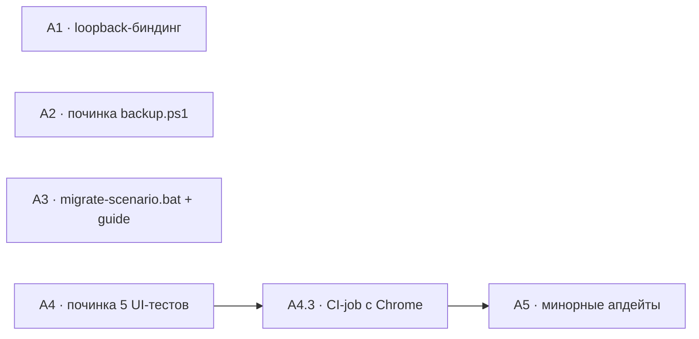

# Техспека — находки анализа проекта 2026-08-11 (сетевая граница, устойчивость данных, гниение тестов)

> Роль-автор: **Системный аналитик**. Адресат: **Разработчик**.
> Вход: анализ роли «Аналитик» этой же сессии («Проведи анализ проекта») — отчёт
> передан в чате, отдельного `-workplan.md` нет.
> Дата: 2026-08-11. Статус: **контракты готовы по всем пяти пунктам,
> открытых вопросов нет. Разработка не начата.**
>
> Решения пользователя по бывшим ОВ-1…ОВ-3 (приняты 2026-08-11): бэкап —
> починить `backup.ps1`, запуск оставить ручным (A2); старый формат сценариев —
> инструкция для пользователя (A3); UI-тесты — job в CI (A4.3).

Нумерация A1–A5 — из отчёта Аналитика. Пункты независимы, общих файлов нет.

**Поправка к отчёту Аналитика по A4.** Отчёт формулировал риск как «UI-тесты вне
гейта, могут тихо гнить». При подготовке контрактов проверено фактически: они
**уже сгнили** — 5 из 59 падают (§4.1). Плюс сам вынос за пределы CI — не дрейф,
а осознанное задокументированное решение (`.github/workflows/test.yml:46-48`,
«intentionally NOT run here»). Формулировка A4 ниже исправлена на фактическую.

---

## A1. Сервер слушает все сетевые интерфейсы без авторизации

### A1.1 Диагноз (проверено эмпирически)

`web/server.js:1102` — `app.listen(PORT, () => {...})` без аргумента хоста. Node
по умолчанию биндится на все интерфейсы:

```
netstat -ano | grep :4295
  TCP    0.0.0.0:4295    LISTENING
  TCP    [::]:4295       LISTENING

curl http://10.25.225.67:4295/api/status   → 200, отдал данные города
curl -H "Host: evil.example.com" ...       → 200 (Host не валидируется)
curl -H "Origin: http://evil.example.com"  → 200, заголовков CORS нет вообще
```

Открыто без авторизации: **196 API-роутов**, из них **20 `DELETE`** (включая
`DELETE /api/cities/:slug` — город целиком), AI-эндпоинты в 10 файлах роутов
(тратят реальные деньги с ключей из `web/.env`; `aiRateLimit` считает **по IP** —
20/мин, т.е. 1200 вызовов в час с каждого адреса), `POST /api/run-tool`
(запуск PowerShell, whitelist ограничивает *чем*, но не *кто*), `POST /api/restart`.

### A1.2 Контракт — `web/server.js`

Переиспользовать уже существующий в файле env-паттерн (`server.js:61`,
`const PORT = process.env.PORT ? parseInt(process.env.PORT) : 4295;`):

```js
// server.js — рядом с объявлением PORT (строка 61)
// Кодревью 2026-08-11 (A1): app.listen(PORT) без хоста биндится на 0.0.0.0 + [::],
// т.е. весь API (196 роутов, 20 DELETE, платные AI-вызовы, запуск PowerShell)
// доступен любому в той же сети без авторизации. Дефолт — loopback; сетевой
// доступ (планшет за игровым столом и т.п.) — только явным HOST=0.0.0.0.
const HOST = process.env.HOST || '127.0.0.1';
```

```js
// server.js:1102
app.listen(PORT, HOST, () => {
```

`HOST` подхватывается и из `web/.env` — загрузчик на `server.js:42` кладёт пары
из файла в `process.env` до этого места. `web/wrapper.js:64` спавнит сервер с
`{ ...process.env, VTM_SUPERVISED: '1' }`, т.е. переменная доходит и через
супервизор — правок в `wrapper.js` не требуется (проверено).

### A1.3 ⚠️ Скрытая связь — не сломать обнаружение старта в тестах

`web/tests/helpers.js:27` определяет, что сервер поднялся, **по подстроке в
stdout**:

```js
if (String(buf).includes(`localhost:${TEST_PORT}`)) { ... }
```

Баннер старта (`server.js:1105`) печатает `http://localhost:${PORT}` — именно эту
строку тесты и ждут. **Нельзя** менять баннер на `http://${HOST}:${PORT}`: при
`HOST=127.0.0.1` подстрока `localhost:4296` исчезнет и все интеграционные тесты
упадут по таймауту старта (15 с каждый).

Контракт: строку `http://localhost:${PORT}` оставить **дословно**. Если хочется
показать реальный адрес при нелокальном биндинге — добавить **отдельную
дополнительную** строку, не трогая существующую:

```js
console.log(`  http://localhost:${PORT}\n`);          // не менять — на неё завязан helpers.js
if (HOST !== '127.0.0.1' && HOST !== 'localhost') {
  console.log(`  ${C.yellow}⚠ Открыт для сети (HOST=${HOST}) — доступен без пароля${C.reset}\n`);
}
```

### A1.4 Документация

Добавить в `docs/guide.md` (раздел про запуск) короткий абзац: по умолчанию
приложение доступно только с этого компьютера; чтобы открыть его с планшета/
телефона в той же сети — запустить с `HOST=0.0.0.0`, понимая, что пароля нет и
любой в этой сети получит полный доступ к данным и к AI-бюджету.

### A1.5 Приёмка

1. `netstat -ano | grep :4295` после обычного старта → только `127.0.0.1:4295`
   (нет `0.0.0.0` и `[::]`).
2. `curl http://<LAN-IP>:4295/api/status` → соединение отклонено.
3. `curl http://127.0.0.1:4295/api/status` → работает как раньше.
4. `HOST=0.0.0.0 node web/server.js` → биндится на все интерфейсы, в консоли —
   предупреждение из A1.3.
5. `npm test` — 754/754 (интеграционные тесты поднимают сервер как раньше;
   это и есть проверка, что A1.3 соблюдён).

---

## A4. Selenium-тесты UI сгнили — 5 из 59 падают

### A4.1 Диагноз (прогнано фактически: `HEADLESS=1 npm run test:ui`)

```
tests 59 · pass 54 · fail 5
```

Вынос этих тестов за пределы CI — осознанное решение
(`.github/workflows/test.yml:46-48`: «Selenium UI tests … require a real Chrome
browser and are intentionally NOT run here»). Проблема не в решении, а в его
последствии: ничто не сигнализирует о расхождении, и оно накопилось.

Пять падений делятся на три класса:

| Класс | Тесты | Причина |
|---|---|---|
| **1. Устаревшие селекторы вкладок** (2) | «кнопка "Пересобрать индекс" отрабатывает»; «рендерит карточки фич с переключателями провайдера» | `нет элемента: .tab-btn[data-tab="more"]` и `.tab-btn[data-tab="ai-settings"]`. Вкладка «Инструменты» была реструктурирована до 4 вкладок, «Ещё» удалена — это **зафиксировано** в source-guard тестах `all.test.js` («вкладка "Инструменты" реструктурирована до 4 вкладок…», «"Учёт данных" содержит перенесённые из "Ещё" инструменты»). Т.е. UI поменяли осознанно, тесты в основном гейте обновили, Selenium-тесты вне гейта — нет. |
| **2. Фикстура района не создаётся** (2) | «страница просмотра города рендерит карточку района»; «привязка "бесхозной" локации к району переносит папку физически» | `нет карточки района «Портовый квартал»` (таймаут 10 с). Оба теста про районы — вероятно связано с реструктуризацией путей районов (миграции `002_district_rayon_paths.js` / `003_district_md_backfill.js`), но **точную причину должен установить Разработчик** — по коду фикстуры не видно, создаётся ли район вообще или создаётся, но не рендерится. |
| **3. Состояние элемента** (1) | «вкладка VtM — форма по 5 полям сохраняется в карточке отдельно от прозы» | `InvalidElementStateError: invalid element state`, падает за 126 мс (не таймаут) — элемент найден, но не в редактируемом состоянии. Похоже на изменившийся флоу входа в режим правки, а не на устаревший селектор. |

### A4.2 Контракт

Чинить **тесты**, не продукт: во всех трёх классах продукт менялся намеренно и
покрыт другими (зелёными) тестами. Порядок — от дешёвого к дорогому:

1. **Класс 1** — заменить `data-tab="more"` / `data-tab="ai-settings"` на
   актуальные id вкладок. Источник истины по актуальной структуре — не догадки, а
   те самые source-guard тесты в `all.test.js`, которые её фиксируют, и
   `web/public/index.html`.
2. **Класс 3** — воспроизвести вручную (открыть вкладку VtM, попробовать
   отредактировать 5 полей), понять, изменился ли флоу; поправить шаги теста.
3. **Класс 2** — самый неясный: сначала выяснить, доезжает ли фикстура «Портовый
   квартал» до диска (проверить в момент падения, что лежит в
   `cities/<тестовый город>/locations/`), и только потом чинить.

### A4.3 Защита от повторного гниения — CI-job с реальным Chrome

**Решение пользователя (ОВ-3): вариант A** — завести job в CI.

Починить один раз недостаточно: без автоматического сигнала набор сгниёт снова
(что уже и произошло — дисциплина как механизм здесь проверена практикой и не
сработала).

**Готовность окружения проверена:**
- `selenium-webdriver` — devDependency в `web/package.json`, т.е. существующий
  шаг `npm install` в CI его уже ставит; отдельной установки не нужно.
- `web/tests/node_modules/` (20 МБ) — локальный артефакт **без своего
  `package.json`** и под `.gitignore`; в CI не воспроизводится и не нужен —
  Node резолвит `selenium-webdriver` вверх по дереву в `web/node_modules`.
- `ui.test.js:103-108` — `new Builder().forBrowser('chrome')`; Selenium Manager
  (встроен в selenium-webdriver 4.x) сам подтягивает совместимый chromedriver.
  При `HEADLESS` добавляются `--headless=new --no-sandbox --disable-gpu`.
- Раннер `windows-latest` (тот же, что у существующих job) поставляется с
  предустановленным Google Chrome — отдельный `setup-chrome` не требуется.
  Если на практике окажется иначе — добавить `browser-actions/setup-chrome@v1`
  перед шагом запуска, остальной контракт не меняется.

Новый job в `.github/workflows/test.yml` — рядом с существующими, не внутрь них
(падение UI не должно маскировать результат основного набора и наоборот):

```yaml
  ui-selenium:
    name: UI (Selenium + Chrome)
    runs-on: windows-latest
    defaults:
      run:
        working-directory: web
    steps:
      - uses: actions/checkout@v4

      - uses: actions/setup-node@v4
        with:
          node-version: '20'

      - name: Install web dependencies
        run: npm install

      - name: UI tests (headless Chrome)
        env:
          HEADLESS: '1'
        run: npm run test:ui
```

**Заменить** устаревший комментарий в конце файла (`test.yml:46-48`,
«intentionally NOT run here») — он перестаёт быть правдой. Вместо него — строка
о том, что локальный прогон делается той же командой:
`HEADLESS=1 npm run test:ui`.

**Важно про `npm run test:ui`:** скрипт в `package.json` начинается с
`set "VTM_TEST_REPORT=report-ui.html" &&` — это cmd-синтаксис, на
`windows-latest` (где shell по умолчанию — PowerShell) он может не отработать.
Проверить на первом же прогоне; если ломается — либо задать шаг с
`shell: cmd`, либо (предпочтительно) вынести `VTM_TEST_REPORT` в блок `env:`
job'а и убрать `set ... &&` из скрипта, как это уже сделано для `test:ci`
(отдельный скрипт без кастомного репортера именно ради кросс-платформенности —
см. комментарий `test.yml:26`).

### A4.4 Приёмка

1. `HEADLESS=1 npm run test:ui` → 59/59.
2. `npm test` → 754/754 (не задето).
3. Продуктовый код (`web/public/**`) в диффе **не изменён** — если для зелёного
   прогона понадобилось трогать продукт, значит найдена настоящая регрессия:
   остановиться и вынести её отдельно, а не чинить «заодно».

---

## A5. Обновление зависимостей

### A5.1 Диагноз (`npm outdated` в `web/`)

| Пакет | Сейчас | Актуально | Класс |
|---|---|---|---|
| `@anthropic-ai/sdk` | 0.102.0 | 0.116.0 | minor |
| `@google/genai` | 2.10.0 | 2.16.0 | minor |
| `undici` | 8.5.0 | 8.10.0 | minor |
| `selenium-webdriver` (dev) | 4.45.0 | 4.47.0 | minor |
| `express` | 4.22.2 | 5.2.1 | **major** |

### A5.2 Контракт

Одним шагом — только минорные (`@anthropic-ai/sdk`, `@google/genai`, `undici`,
`selenium-webdriver`). После обновления обязателен полный `npm test` **и**
`HEADLESS=1 npm run test:ui` (selenium тоже в списке).

`@anthropic-ai/sdk` стоит поднять первым и отдельным коммитом: в этой сессии уже
был инцидент с устаревшими/несуществующими ID моделей, который SDK новее ловит
раньше и понятнее.

**Express 4 → 5 в этот объём не входит.** Major с breaking changes в роутинге и
обработке ошибок при 196 роутах — отдельная задача со своей приёмкой, не «заодно
с апдейтом минорных».

### A5.3 Приёмка

1. `npm outdated` — минорных расхождений не осталось (кроме намеренно
   отложенного `express`).
2. `npm test` → 754/754.
3. Один живой прогон AI-генерации (любой модуль, нейтральный контент) — SDK
   обновился, путь до провайдера не сломан.

---

## A2. Бэкап арта — починка `tools/backup.ps1`

**Решение пользователя (ОВ-1): вариант D** — починить скрипт, запуск оставить
ручным. Планировщик/облако не заводим.

### A2.1 Диагноз

`*.jpg/png/gif/webp` и `cities/audio/` в `.gitignore`; 79 папок `art/`,
`cities/paris/characters` = **120 МБ**. Текстовые данные в git и запушены
(`master` синхронизирован с `origin/master`) — под угрозой только бинарники.

`tools/backup.ps1` (36 строк) **уже включает арт** — копирует всё, кроме списка
исключений. Дефекты самого списка:

| Строка | Что не так |
|---|---|
| `$exclude = @("img-personj", ".claude", "tools")` | `img-personj` — **такой папки в проекте нет** (мёртвая настройка, ничего не исключает) |
| там же | **Не исключены** `web/node_modules` (68 МБ) и `web/tests/node_modules` (20 МБ) — 88 МБ восстанавливаемого мусора в каждом архиве, при полезной нагрузке ~130 МБ |

### A2.2 Контракт

```powershell
# tools/backup.ps1 — было: $exclude = @("img-personj", ".claude", "tools")
# img-personj убран — папки с таким именем в проекте нет (мёртвая настройка).
# node_modules исключаются на любом уровне вложенности: 88 МБ полностью
# восстанавливаемого содержимого (npm install), в архиве смысла не имеют.
$exclude = @(".claude", "tools", ".git")
```

`Copy-Item -Recurse` тянет вложенные `node_modules` вместе с `web/`, поэтому
одним `$exclude` верхнего уровня их не отсечь — нужен отдельный шаг очистки
после копирования (проще и надёжнее, чем переписывать копирование на
пофайловый обход с фильтром):

```powershell
# После блока Copy-Item, перед Compress-Archive:
Get-ChildItem -Path $tempDir -Directory -Recurse -Force -Filter 'node_modules' |
    Sort-Object { $_.FullName.Length } -Descending |
    ForEach-Object { Remove-Item -LiteralPath $_.FullName -Recurse -Force -ErrorAction SilentlyContinue }
```

`.git` добавлен в исключения намеренно: история и так есть на GitHub, а в архиве
это лишние сотни мегабайт. **Если Разработчик считает иначе** (архив как
полностью самодостаточный слепок) — оставить `.git`, но тогда явно сказать об
этом в выводе скрипта; решение допустимо любое, главное осознанное.

### A2.3 Напоминание про диск — вывод скрипта

`OutDir` по умолчанию — родительская папка проекта, т.е. **тот же физический
диск**: от отказа диска такой бэкап не защищает. Менять дефолт не нужно
(пользователь выбрал минимальный вариант), но скрипт обязан об этом сказать —
иначе бэкап создаёт ложное чувство защищённости:

```powershell
# После вывода "Done: $zipPath ($size KB)":
if ((Split-Path -Qualifier $zipPath) -eq (Split-Path -Qualifier $Root)) {
    Write-Host "  ! Архив на том же диске, что и проект - от отказа диска не защищает." -ForegroundColor Yellow
    Write-Host "    Скопируйте его на внешний диск или в облачную папку," -ForegroundColor DarkGray
    Write-Host "    либо запустите: .\tools\backup.ps1 -OutDir 'D:\Backups'" -ForegroundColor DarkGray
}
```

### A2.4 Приёмка

1. `.\tools\backup.ps1 -OutDir <временная папка>` отрабатывает без ошибок.
2. В получившемся `.zip` **нет** ни одной папки `node_modules` (проверить
   поиском по содержимому архива).
3. В архиве **есть** арт — например `cities/paris/characters/*/art/` с файлами
   (это и есть цель всей задачи, проверить явно, а не на веру).
4. Размер архива заметно меньше прежнего (ориентир: минус ~88 МБ на
   `node_modules`; точное число зависит от сжатия).
5. При запуске без `-OutDir` в выводе появляется жёлтое предупреждение про тот
   же диск; при запуске с `-OutDir` на другом диске — не появляется.

---

## A3. Старый формат `scenario.md` у пользователей релиза

**Решение пользователя (ОВ-2): вариант A** — инструкция в `docs/guide.md`.

### A3.1 Диагноз

Формат сценария изменён (упрощение до 3 блоков).
`tools/migrate_old_scenario_format.js` намеренно standalone — автоматически
переписывать прозу сыгранного контента при старте нельзя, это решение остаётся
верным. Но скрипта нет в `tools/release-exclude.json`, т.е. он попадёт в
релизную сборку, а пользователь не узнает, что его надо запускать.

### A3.2 ⚠️ Регистр `docs/guide.md` — CLI туда не вписывается

Проверено: `guide.md` (702 строки, 20 разделов) написан **строго для
не-технического Рассказчика**. Единственное упоминание чего-либо за пределами
интерфейса — «**Двойной клик на `start.bat`** — единственное, что нужно
сделать» (`guide.md:34`). Ни одной команды вида `node tools/...` в документе
нет.

Вставить туда `node tools/migrate_old_scenario_format.js --dry-run` — сломать
этот регистр: пользователь, которому всё подаётся двойным кликом, получает
терминал.

**Сложившийся в проекте паттерн доставки** — `.bat`-обёртка в корне:
`start.bat`, `stop.bat`, `update.bat`. Миграция должна прийти тем же способом.

### A3.3 Контракт — `migrate-scenario.bat` в корне проекта

По образцу существующих обёрток (`@echo off` + `cd /d "%~dp0"` + понятная
рамка вывода + пауза в конце, как в `backup.ps1`/`start.bat`):

```bat
@echo off
cd /d "%~dp0"

echo.
echo  =============================================
echo   Sanguine System - обновление формата сценариев
echo  =============================================
echo.
echo  Сначала - проверка без изменений (dry-run).
echo.

node tools\migrate_old_scenario_format.js
if %errorlevel% neq 0 goto fail

echo.
echo  Выше показано, что БУДЕТ изменено. Ничего ещё не записано.
echo.
choice /C YN /M "Применить эти изменения"
if errorlevel 2 goto cancelled
if errorlevel 1 goto apply

:apply
node tools\migrate_old_scenario_format.js --apply
echo.
echo  Готово. Старые сценарии приведены к текущему формату.
goto end

:cancelled
echo.
echo  Отменено - файлы не изменены.
goto end

:fail
echo.
echo  Ошибка при проверке. Файлы не изменены.

:end
echo.
pause
```

Ключевое в контракте: **сначала всегда dry-run, применение — только после
явного подтверждения**. Это ровно та защита, ради которой скрипт делался
standalone; `.bat` не должен её обходить ради «удобства».

### A3.4 Контракт — раздел в `docs/guide.md`

Новый раздел **«21. Обслуживание»** в конце (перед «Горячие клавиши»), плюс
строка в оглавлении (`guide.md:7-31`). Содержание — в регистре документа, без
терминала:

- что произошло: формат сценариев упрощён (Пролог / Сцена N / Финал), старые
  модули продолжают открываться и редактироваться как раньше — чинить их
  необязательно;
- если хочется единообразия — **двойной клик на `migrate-scenario.bat`**;
  сначала покажет, что изменится, и спросит подтверждение;
- что миграция трогает только файлы, которые уверенно распознала, а
  нестандартные пропускает, назвав причину;
- что данные под git — при желании изменения можно откатить.

### A3.5 Приёмка

1. Двойной клик на `migrate-scenario.bat` в чистой копии проекта: сначала
   dry-run-вывод, затем вопрос, при ответе «N» — файлы не изменены (проверить
   `git status`).
2. При ответе «Y» — миграция применяется, вывод совпадает с прямым запуском
   `node tools/migrate_old_scenario_format.js --apply`.
3. Раздел 21 в `guide.md` виден и в приложении (вкладка «Инструменты» →
   «📖 Инструкции» рендерит этот же файл — проверить, что оглавление кликабельно
   и якорь `#21-обслуживание` работает).
4. `node tools/build_release.js --dry-run` проходит — новый `.bat` в корне не
   ломает сборку (и попадает в релиз вместе со скриптом, что и требуется).

---

## Порядок сдачи



**A1 — первым:** одна строка, снимает единственный критичный риск.

**A4 — строго по цепочке:** сначала починить 5 тестов, только потом включать
job в CI (иначе первый же push даёт красный CI, который придётся глушить или
объяснять). И только после зелёного CI — A5: обновлять зависимости имеет смысл,
когда есть рабочий сигнал, иначе непонятно, что сломал апдейт, а что было
сломано до него.

**A2 и A3 независимы** от всего остального и друг от друга — можно вести
параллельно в любой момент.

**Обязательное к соблюдению** (`CLAUDE.md` → «Веб-интерфейс»): A1 меняет
серверный код — `/code-review` перед сдачей. A4 трогает тесты, а не продукт
(если для зелёного прогона понадобилось править `web/public/**` — это найденная
регрессия, выносить отдельно, см. A4.4 п.3). A3 добавляет файл в корень проекта
— проверить `node tools/build_release.js --dry-run`.
